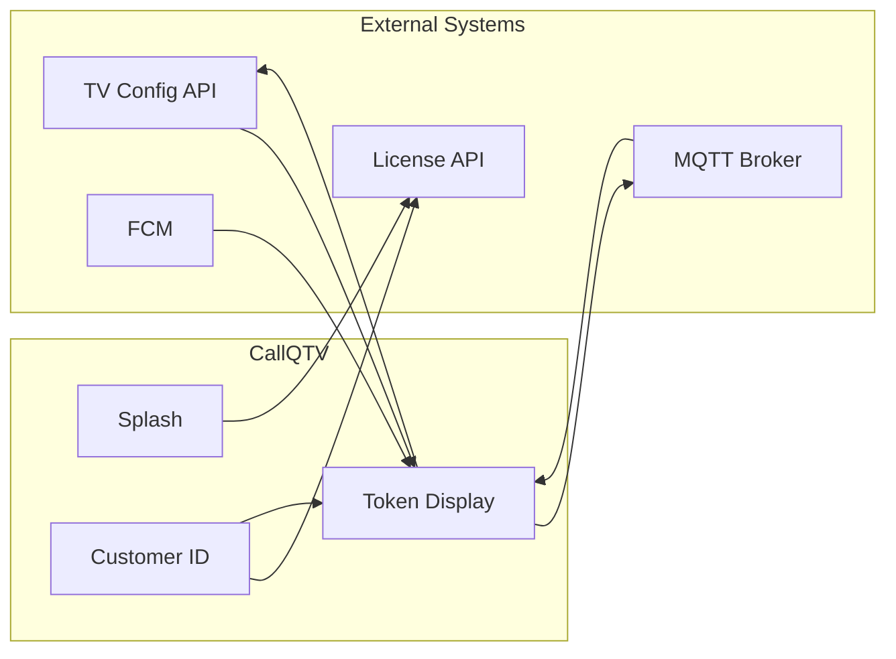
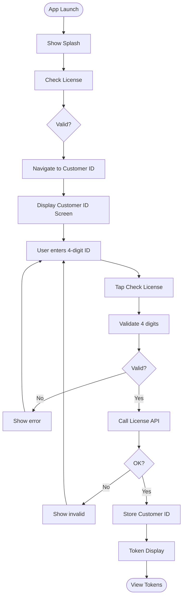
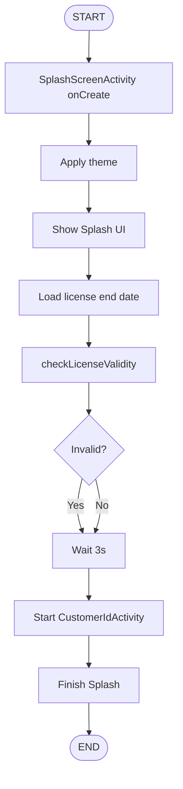
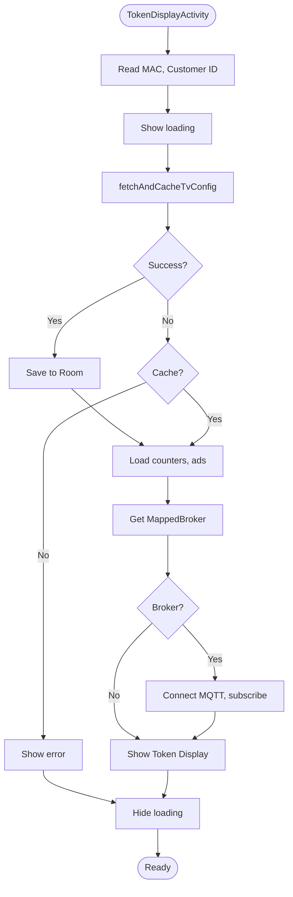
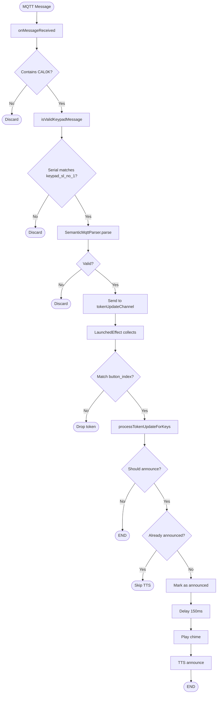
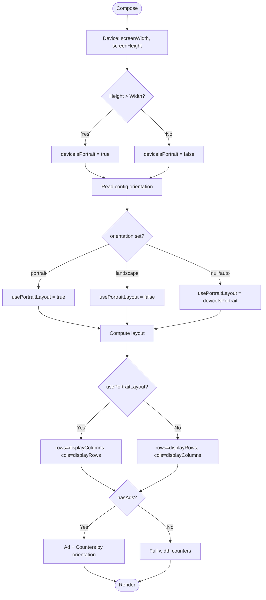
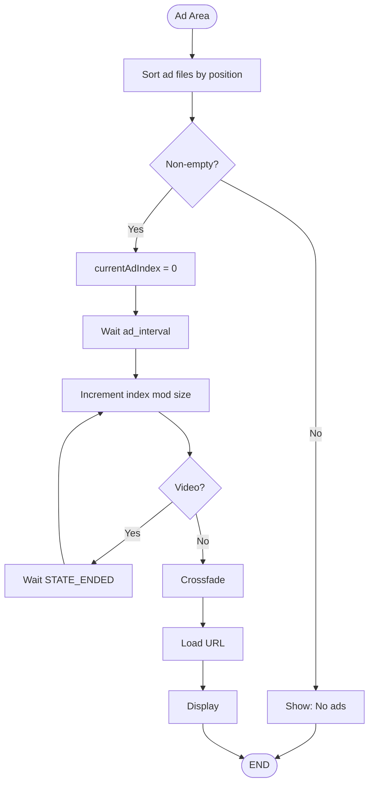
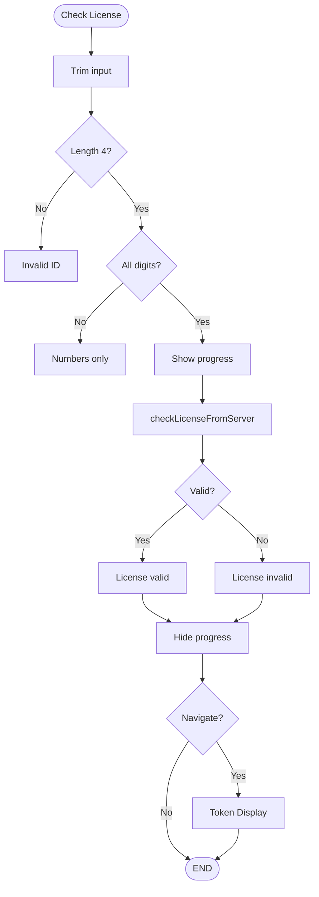

# CallQTV – Flow Charts

**Document Version:** 2.0  
**Application:** CallQTV (Android TV Token Display)  
**Last Updated:** March 2026

---

## Notation (Mermaid)

| Symbol        | Meaning           | Mermaid   |
|---------------|-------------------|-----------|
| Rounded box   | Start / End       | `([text])` |
| Rectangle     | Process / Action  | `[text]`  |
| Diamond       | Decision (Y/N)    | `{text}`  |
| Arrow         | Flow direction    | `-->`     |

Render in GitHub, GitLab, or VS Code (Mermaid extension).

---

## Flow Chart 0: System Context

---

## Flow Chart 1: Application Lifecycle

---

## Flow Chart 2: Splash & Navigation

---

## Flow Chart 3: Token Display Load & MQTT

---

## Flow Chart 4: MQTT Message to TTS (Detailed)

---

## Flow Chart 5: Orientation & Layout

---

## Flow Chart 6: Advertisement Rotation

---

## Flow Chart 7: Customer ID Validation

---

## Related Documents

- **SRS.md** – Software Requirements Specification
- **WIREFRAMES.md** – UI Wireframes
