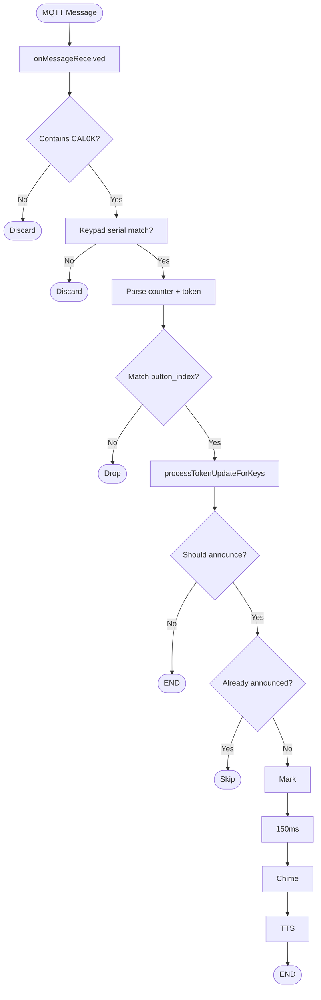

# CallQTV – SRS, Flow Charts & Wireframes (Consolidated)

**Document Version:** 2.0  
**Last Updated:** March 2026

---

## Document Index

| Document | Description |
|----------|-------------|
| **[SRS.md](SRS.md)** | Full Software Requirements Specification |
| **[FLOWCHARTS.md](FLOWCHARTS.md)** | Mermaid flow charts (system, lifecycle, MQTT, orientation, etc.) |
| **[WIREFRAMES.md](WIREFRAMES.md)** | ASCII UI wireframes for all screens |

---

## 1. SRS Summary

CallQTV is an Android TV app for queue token display, MQTT token reception, TTS announcements, and ad rotation. Key capabilities:

- **Splash** → License check → **Customer ID** (4-digit) → **Token Display**
- **TV Config** from API: orientation, layout_type, counters, ads, MQTT broker, enable_counter_announcement, enable_token_announcement, enable_counter_prifix
- **Orientation:** Config-driven (portrait/landscape) overrides device; affects layout and token grid.
- **Token prefix:** When enable_counter_prifix=true, tokens show as "A-36"; otherwise "36".
- **MQTT:** Fixed protocol `$<serial><counter><token>*`; keypad serial validated against connected devices.
- **TTS:** Deduplication, atomic storage, 150ms delay for UI sync.

---

## 2. Key Flow Charts (Preview)

### 2.1 System Context
```
[License API] [TV Config API] [MQTT Broker] [FCM]
       \           |              |          /
        \          v              v         /
         \    [CallQTV: Splash → Customer ID → Token Display]
```

### 2.2 MQTT → TTS (Simplified)
```
MQTT Message → Keypad serial valid? → Parse → Match button_index?
    → processTokenUpdateForKeys (atomic) → Already announced?
    → Mark → Delay 150ms → Chime → TTS
```

### 2.3 Orientation
```
config.orientation = "portrait" | "landscape" | null
    → usePortraitLayout (or device default)
    → Ad layout (Column/Row), token grid (rows/cols swap)
```

Full flowcharts in **[FLOWCHARTS.md](FLOWCHARTS.md)**.

---

## 3. Key Wireframes (Preview)

| Screen | Layout |
|--------|--------|
| Splash | Full-screen gradient, centered logo |
| Customer ID | 4 digit boxes, Check License, theme icon |
| Token Display | Header (company, date/time, MQTT, network, theme), counters (Type 1/2), ads (left/right), footer |
| Settings | Company info, Token/Counter Announcement, Counter Prefix, sound, theme, colors |

Full wireframes in **[WIREFRAMES.md](WIREFRAMES.md)**.

---

## 4. Mermaid Flow Chart – MQTT to TTS (Full)



---

*For complete SRS, flowcharts, and wireframes, see the linked documents.*
