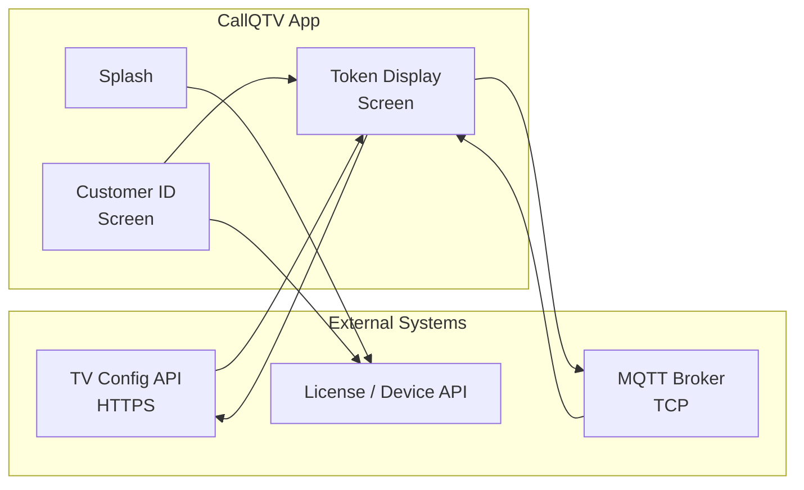
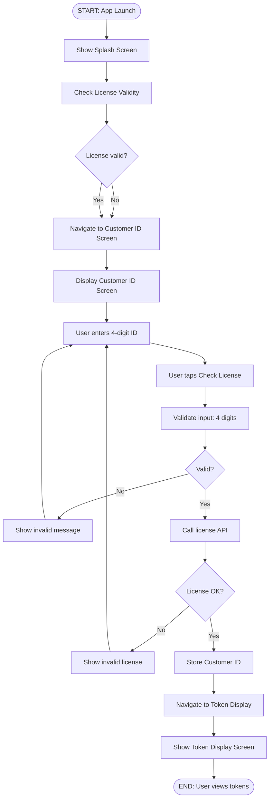
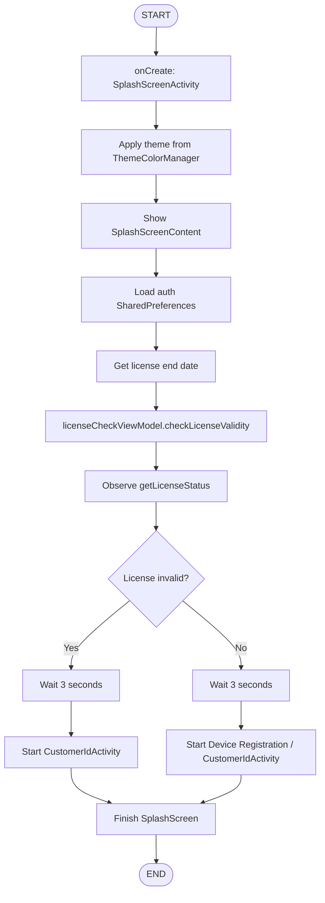
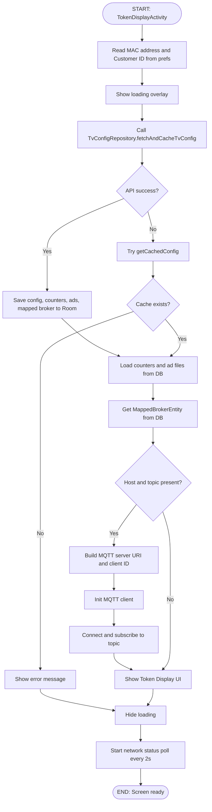
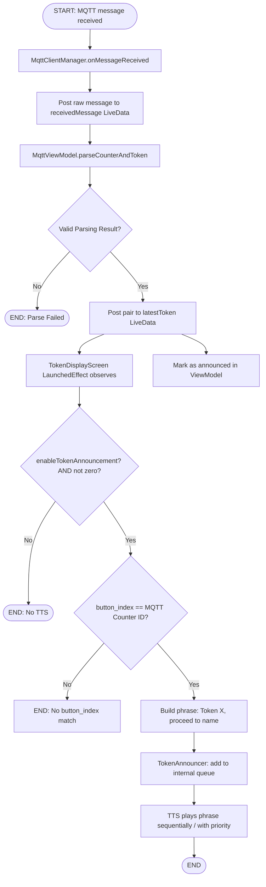
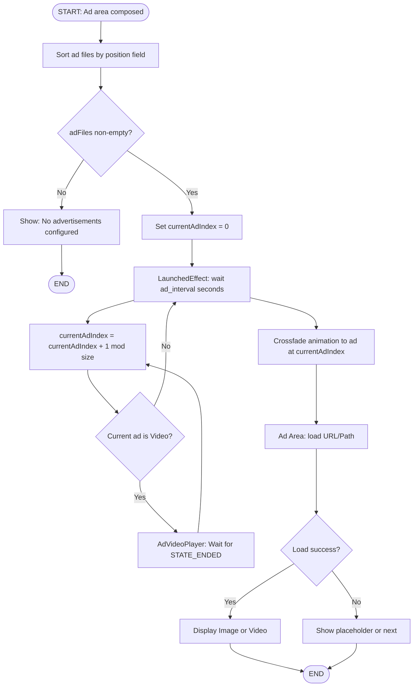
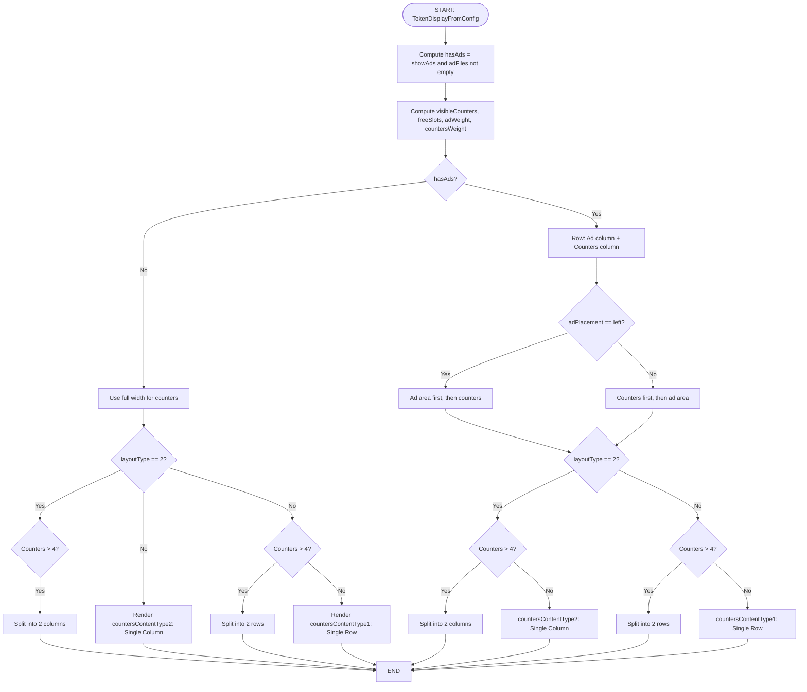
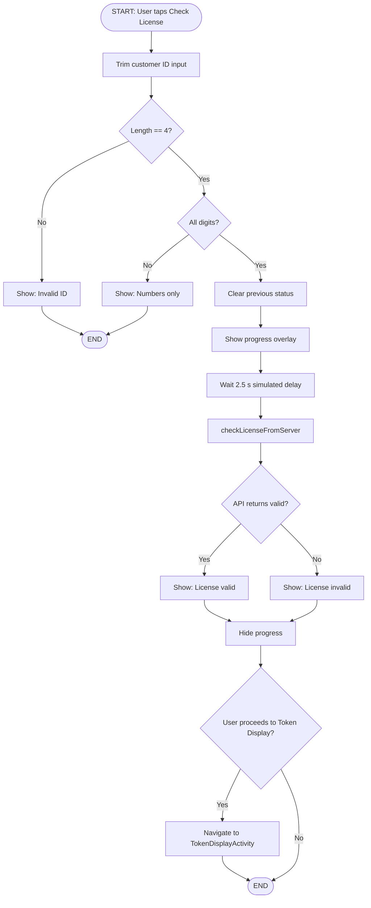

# CallQTV – Software Requirements Specification (SRS)

**Document Version:** 1.0  
**Application:** CallQTV (Android TV Token Display)  
**Last Updated:** As of current codebase

---

## 1. Introduction

### 1.1 Purpose

This Software Requirements Specification (SRS) describes the functional and non-functional requirements for **CallQTV**, an Android application designed for Android TV and similar devices. The application displays queue tokens for multiple counters, plays advertisements, receives token updates via MQTT, and announces tokens using on-device Text-to-Speech (TTS).

### 1.2 Scope

- **In scope:** Splash screen, Customer ID entry and license validation, TV configuration loading, token display with configurable layouts, advertisement rotation, MQTT integration, TTS announcements, dynamic theming, and responsive UI for various TV screen sizes.
- **Out of scope:** Backend API implementation, MQTT broker setup, content management for ads (content is provided via URLs in configuration).

### 1.3 Definitions and Acronyms

| Term | Definition |
|------|-------------|
| **Token** | A queue number assigned to a customer for a specific counter. |
| **Counter** | A service point (e.g., counter 1, Ortho) that displays its own token list. |
| **MQTT** | Message Queuing Telemetry Transport; protocol used for real-time token updates. |
| **TTS** | Text-to-Speech; on-device announcement of token numbers and counter names. |
| **TV Config** | Backend configuration (layout, colors, counters, ads, MQTT broker) fetched per device/customer. |
| **Display Type 1** | Horizontal layout: counters in a row; optional ad column on left/right. |
| **Display Type 2** | Vertical layout: counters stacked in a column; optional ad column on left/right. |

### 1.4 References

- Architecture & Function-Wise Workflow: `ARCHITECTURE_AND_WORKFLOW.md`
- Android TV Design Guidelines
- Jetpack Compose, Room, Retrofit, Paho MQTT documentation

---

## 2. Product Overview

### 2.1 Product Perspective

CallQTV is a standalone Android application that:

1. Runs on Android TV (and compatible devices) with minimum SDK 26.
2. Requires the user to enter a 4-digit Customer ID and validate license via backend.
3. Fetches TV-specific configuration from a REST API and caches it in a local Room database.
4. Displays company name, current date/time, multiple counter boards with tokens, and optionally an advertisement strip/column.
5. Connects to an MQTT broker (configuration from API) and subscribes to a topic to receive token call messages.
6. Announces called tokens using TTS in a configurable language (e.g., English, Malayalam).
7. Allows the user to change the application theme (primary color and background intensity) with a live preview.

### 2.2 User Classes

| User Class | Description |
|------------|-------------|
| **TV Operator / Reception** | Views token display and advertisement area; may use "Test Call" to verify TTS. |
| **Setup / Admin** | Enters Customer ID, checks license, and optionally changes theme. |

### 2.3 Operating Environment

- **Platform:** Android OS (API 26+), optimized for Android TV (UI_MODE_TYPE_TELEVISION).
- **Network:** Internet for license check, TV config API, and MQTT; HTTPS for config API; TCP for MQTT.
- **Storage:** Local Room database for config, counters, ads, and mapped broker; SharedPreferences for theme and auth.

---

## 3. Functional Requirements

### 3.1 Splash Screen

| ID | Requirement | Priority |
|----|-------------|----------|
| FR-S1 | The system shall display a splash screen with the application logo. | High |
| FR-S2 | The splash background shall use a gradient based on the user-selected theme color. | Medium |
| FR-S3 | The logo shall scale responsively (e.g., 1920×1080 baseline) and support a subtle pulse animation. | Medium |
| FR-S4 | The system shall check license validity using the stored license end date. | High |
| FR-S5 | After a defined delay (e.g., 3 seconds), the system shall navigate to Customer ID screen or device registration flow as per license result. | High |

### 3.2 Customer ID & License

| ID | Requirement | Priority |
|----|-------------|----------|
| FR-C1 | The system shall provide a 4-digit numeric Customer ID input (e.g., digit boxes). | High |
| FR-C2 | The system shall validate input: exactly 4 characters, digits only. | High |
| FR-C3 | The system shall allow the user to trigger a license check against the backend. | High |
| FR-C4 | The system shall display license status (valid/invalid) with appropriate messaging. | High |
| FR-C5 | The system shall support optional APK update check and download/install flow. | Medium |
| FR-C6 | The system shall allow the user to open a theme selection (color picker) from this screen. | Medium |
| FR-C7 | The Customer ID screen background shall reflect the selected theme (e.g., white-to-theme gradient). | Low |
| FR-C8 | On successful license validation, the system shall store Customer ID and navigate to Token Display. | High |

### 3.3 TV Configuration & Token Display

| ID | Requirement | Priority |
|----|-------------|----------|
| FR-T1 | The system shall fetch TV configuration from a configurable REST API (mac_address, customer_id). | High |
| FR-T2 | The system shall cache the configuration (and related counters, ad files, mapped broker) in a local Room database. | High |
| FR-T3 | On network failure or timeout, the system shall fall back to the last cached configuration when available. | High |
| FR-T4 | The system shall display a loading overlay while fetching configuration. | High |
| FR-T5 | The system shall display an error message when configuration is unavailable and no cache exists. | High |
| FR-T6 | The token display shall show: company name, current date and time (updating every second), MQTT connection status, and network availability. | High |
| FR-T7 | The token display shall show one or more counter boards; each board has a header (counter name) and a grid of token cells (rows × columns from config). | High |
| FR-T8 | The number of counter boards shall be determined by the actual counters in the database (or config no_of_counters). | High |
| FR-T9 | **Display Type 1:** Counters shall be arranged in a horizontal row; if the number of counters exceeds 4, the UI shall split into two horizontal rows (top and bottom) to maintain readability on large screens. | High |
| FR-T10 | **Display Type 2:** Counters shall be arranged in a vertical column; if the number of counters exceeds 4, the UI shall split into two vertical columns (left and right) to maintain readability on large screens. | High |
| FR-T11 | Layout type shall be selected via configuration (e.g., layout_type "1" or "2"). | High |
| FR-T12 | When advertisements are enabled and ad files exist, an ad area shall be shown (left or right per ad_placement). | High |
| FR-T13 | The ad area shall rotate through ad images or videos from the TV config; images use fixed intervals, while videos advance upon completion. | High |
| FR-T14 | When the number of counters is less than the maximum configured, the freed space shall be allocated to the advertisement area. | Medium |
| FR-T15 | The system shall display device MAC address and application version at the bottom center. | Medium |
| FR-T16 | The system shall provide a "Test Call" button to trigger a sample TTS announcement (e.g., "Token 1, please proceed to Counter 1"). | Medium |
| FR-T17 | The system shall allow the user to open a theme picker (e.g., rainbow icon) and apply a new theme with preview. | Medium |

### 3.4 Advertisements

| ID | Requirement | Priority |
|----|-------------|----------|
| FR-A1 | Ad content shall be loaded from URLs provided in the TV config (ad_files). | High |
| FR-A2 | Ads shall be ordered by the position field from the API/database. | High |
| FR-A3 | Transition between ads shall use a smooth animation (e.g., crossfade). | Medium |
| FR-A4 | Image loading shall support HTTP/HTTPS and show a placeholder or message when URL is invalid or empty. | High |

### 3.5 MQTT & Token Announcements

| ID | Requirement | Priority |
|----|-------------|----------|
| FR-M1 | The system shall connect to an MQTT broker using host, port, and optional credentials from the mapped_broker configuration. | High |
| FR-M2 | The system shall subscribe to a configurable topic after connection. | High |
| FR-M3 | The system shall parse incoming messages for counter name and token number (JSON or plain). | High |
| FR-M4 | The system shall expose connection status and detailed error messages (e.g., reason code) in the UI. | High |
| FR-M5 | When token announcement is enabled in config, the system shall announce each new token via TTS in the configured audio_language. | High |
| FR-M6 | The system shall announce tokens using the phrasing: "Token [Number], please proceed to [Counter Name]". | High |
| FR-M7 | Each unique token call shall be announced only once per counter. | High |
| FR-M8 | Any new token call shall immediately interrupt any ongoing announcement to ensure real-time visibility and audio alignment. | High |
| FR-M9 | Zero-value tokens (e.g., "0", "00") shall be ignored for announcements. | Medium |
| FR-M10 | TTS shall work without Google Play Services (on-device engine). | High |

### 3.6 Theming

| ID | Requirement | Priority |
|----|-------------|----------|
| FR-Th1 | The user shall be able to select a theme color (e.g., via hue and saturation sliders). | Medium |
| FR-Th2 | The user shall be able to adjust background transparency/intensity for gradients. | Medium |
| FR-Th3 | A preview of the selected theme shall be shown before applying. | Medium |
| FR-Th4 | Applied theme shall affect: Splash, Customer ID screen, Token Display (header, background, accents). | Medium |

---

## 4. Non-Functional Requirements

### 4.1 Performance

| ID | Requirement |
|----|-------------|
| NFR-P1 | TV config API response shall be handled with a timeout (e.g., 60 s); fallback to cache on timeout. |
| NFR-P2 | Ad images shall be loaded asynchronously (e.g., Coil) with optional crossfade. |
| NFR-P3 | UI shall remain responsive on TV (smooth animations, no blocking on main thread). |

### 4.2 Usability

| ID | Requirement |
|----|-------------|
| NFR-U1 | Layout shall scale for different screen sizes (e.g., BoxWithConstraints, responsive dp/sp). |
| NFR-U2 | Token text and counter names shall be readable (e.g., white token cards, configurable font size). |
| NFR-U3 | Theme picker dialog shall have a white background and readable text for accessibility. |

### 4.3 Reliability

| ID | Requirement |
|----|-------------|
| NFR-R1 | Application shall not crash on null or missing API fields (e.g., shift_details JsonNull). |
| NFR-R2 | Global exception handler may suppress known OEM-specific crashes (e.g., IS_MIUI_LITE_VERSION). |

### 4.4 Security

| ID | Requirement |
|----|-------------|
| NFR-S1 | Sensitive data (e.g., MQTT password) shall be stored per app; API over HTTPS. |
| NFR-S2 | Cleartext traffic may be allowed only where required (e.g., local MQTT). |

### 4.5 Compatibility

| ID | Requirement |
|----|-------------|
| NFR-C1 | Minimum SDK 26; target/compile SDK 34. |
| NFR-C2 | Optimized for Android TV; supports D-pad/remote where applicable. |

---

## 5. Use Cases (Summary)

| UC-1 | Splash & Navigate | Actor: System | Precondition: App launched. Flow: Show splash → Check license → Navigate to Customer ID or registration. |
| UC-2 | Enter Customer ID & Check License | Actor: User | Precondition: On Customer ID screen. Flow: Enter 4-digit ID → Validate → Check license → See status → On success, proceed to Token Display. |
| UC-3 | View Token Display | Actor: User (TV viewer) | Precondition: Valid license, on Token Display. Flow: System loads config → Shows company, date/time, counters, tokens, optional ads, status. |
| UC-4 | Receive Token via MQTT & Hear Announcement | Actor: System / Backend | Precondition: MQTT connected, announcements enabled. Flow: Message received → Parse counter + token → Queue TTS → Speak. |
| UC-5 | Change Theme | Actor: User | Precondition: On Customer ID or Token Display. Flow: Open theme picker → Adjust hue/saturation/intensity → Preview → Apply → UI updates. |
| UC-6 | Test TTS | Actor: User | Precondition: On Token Display. Flow: Tap "Test Call" → Sample announcement played. |

---

## 6. Constraints and Assumptions

- **Backend:** TV config API and license/device registration APIs are existing; request/response formats are fixed.
- **MQTT:** Broker is provisioned externally; topic and payload format (e.g., JSON with counter_name, token_no) are agreed.
- **Ads:** Ad URLs point to images (e.g., Coil-compatible); video not required in current scope.
- **Localization:** TTS language is driven by config (e.g., audio_language "en", "ml"); no in-app locale switching beyond that.

---

# Flow Charts

**Notation (ANSI-style):**

| Symbol        | Meaning        | Mermaid  |
|---------------|----------------|----------|
| Rounded box   | Start / End    | `([text])` |
| Rectangle     | Process / Action | `[text]` |
| Diamond       | Decision (Yes/No) | `{text}` |
| Arrow         | Flow direction | `-->`    |
| Label on arrow| Condition      | `-->|Yes|` |

Diagrams use [Mermaid](https://mermaid.js.org/) syntax. Render in GitHub, GitLab, or VS Code (Mermaid extension).

---

## Flow Chart 0: System Context (External Systems & App)



---

## Flow Chart 1: Application Lifecycle (High Level)



---

## Flow Chart 2: Splash Screen & Navigation (Detail)



---

## Flow Chart 3: Token Display Load & MQTT Setup (Detail)



---

## Flow Chart 4: MQTT Message to TTS Announcement (Detail)



---

## Flow Chart 5: Advertisement Rotation (Detail)



---

## Flow Chart 6: Layout Type & Ad Space Allocation (Detail)



---

## Flow Chart 7: Customer ID Validation & License Check (Detail)



---

# Wireframes

Wireframes below are ASCII/text representations of the main screens. Keys: `+` corners, `-` horizontal, `|` vertical, `[ ]` buttons/inputs, `===` header/footer.

---

## Wireframe 1: Splash Screen

```
+------------------------------------------------------------------+
|                                                                  |
|                    (Theme gradient background)                   |
|                                                                  |
|                         +----------------+                       |
|                         |                |                       |
|                         |   CallQ TV     |   (Logo with pulse)   |
|                         |     Logo       |                       |
|                         |                |                       |
|                         +----------------+                       |
|                                                                  |
|                                                                  |
+------------------------------------------------------------------+
```

- Full-screen gradient (primary color, alpha 0.35 → 0.75).
- Centered logo; size scales with screen (e.g., 150–400 dp).
- No buttons; auto-navigation after ~3 s.

---

## Wireframe 2: Customer ID Screen

```
+------------------------------------------------------------------+
|  (Gradient: White -> Theme color, intensity from ThemeColorManager)|
|                                                                  |
|                      CallQ TV / App Name                         |
|                                                                  |
|              +----+  +----+  +----+  +----+                       |
|              | 0  |  | 0  |  | 0  |  | 0  |   <- 4 digit boxes    |
|              +----+  +----+  +----+  +----+                       |
|                                                                  |
|              [      Check License      ]                         |
|                                                                  |
|              +------------------------------------------+       |
|              |  Status: Valid / Invalid message         |       |
|              +------------------------------------------+       |
|                                                                  |
|              Device: XX:XX:XX:XX:XX:XX    Version: 1.0.0         |
|                                              [Theme icon]        |
+------------------------------------------------------------------+
```

- Digit fields: 4 separate boxes; numeric only.
- Single primary button for license check.
- Status area appears below after check (AnimatedVisibility).
- Footer: device ID, app version; theme icon for color picker.

---

## Wireframe 3: Token Display – Display Type 1, With Ads (Left)

```
+------------------------------------------------------------------+
| Company Name          dd-mm-yyyy HH:mm:ss   ● BROKER  ● Network  🌈|
+------------------------------------------------------------------+
|                    [ Test Call ]                                   |
+--------+---------+---------+---------+---------+------------------+
|        | Counter1| Counter2| Counter3| Counter4|                  |
|  Adv   +---------+---------+---------+---------+                  |
|  area  | T1  T2  | T5  T6  | T9  T10 | T13 T14 |                  |
|  (img) | T3  T4  | T7  T8  | T11 T12 | T15 T16 |                  |
|        |         |         |         |         |                  |
+--------+---------+---------+---------+---------+------------------+
|        Device: XX:XX:XX:XX:XX:XX    Version: 1.0.0               |
+------------------------------------------------------------------+
```

- Top bar: company left; date/time and status right; theme icon far right.
- Row: Ad column (weight from adWeight) | Counter boards (weight from countersWeight).
- Each counter: header + grid of token cells (e.g., 2×4).
- Bottom: MAC and version centered.

---

## Wireframe 4: Token Display – Display Type 1, No Ads

```
+------------------------------------------------------------------+
| Company Name          dd-mm-yyyy HH:mm:ss   ● BROKER  ● Network  🌈|
+------------------------------------------------------------------+
|                    [ Test Call ]                                   |
+---------+---------+---------+---------+---------------------------+
|Counter1 | Counter2| Counter3| Counter4|                          |
+---------+---------+---------+---------+                          |
| T1  T2  | T5  T6  | T9  T10 | T13 T14 |                          |
| T3  T4  | T7  T8  | T11 T12 | T15 T16 |                          |
+---------+---------+---------+---------+---------------------------+
|        Device: XX:XX:XX:XX:XX:XX    Version: 1.0.0               |
+------------------------------------------------------------------+
```

- Same header/footer; full width for horizontal counter row.
- No ad column.

---

## Wireframe 5: Token Display – Display Type 2, With Ads (Left)

```
+------------------------------------------------------------------+
| Company Name          dd-mm-yyyy HH:mm:ss   ● BROKER  ● Network  🌈|
+------------------------------------------------------------------+
|                    [ Test Call ]                                   |
+--------+----------------------------------------------------------+
|        | Counter1                                                 |
|  Adv   +----------------------------------------------------------+
|  area  | Counter2                                                 |
|  (img) +----------------------------------------------------------+
|        | Counter3                                                 |
|        +----------------------------------------------------------+
|        | Counter4                                                 |
+--------+----------------------------------------------------------+
|        Device: XX:XX:XX:XX:XX:XX    Version: 1.0.0               |
+------------------------------------------------------------------+
```

- Ad column left; right side: vertical stack of counter boards (each with header + token grid).

---

## Wireframe 6: Token Display – Display Type 2, No Ads

```
+------------------------------------------------------------------+
| Company Name          dd-mm-yyyy HH:mm:ss   ● BROKER  ● Network  🌈|
+------------------------------------------------------------------+
|                    [ Test Call ]                                   |
+----------------------------------------------------------+
| Counter1                                                 |
+----------------------------------------------------------+
| Counter2                                                 |
+----------------------------------------------------------+
| Counter3                                                 |
+----------------------------------------------------------+
| Counter4                                                 |
+----------------------------------------------------------+
|        Device: XX:XX:XX:XX:XX:XX    Version: 1.0.0               |
+------------------------------------------------------------------+
```

- Full width vertical stack of counter boards; no ad column.

---

## Wireframe 7: Theme Picker Dialog

```
+---------------------------+
|  Choose Theme Color       |
+---------------------------+
| [===== Hue gradient =====]|
| --------o----------------  Hue slider
|
| Color Intensity           |
| ----------o-------------   Saturation
|
| Background Transparency   |
| ----------o-------------   Intensity
|
| Preview                   |
| +------------------------+
| |  (Mini header bar      |
| |   in selected color)   |
| +------------------------+
|
|    [ Cancel ]  [ Apply ]  |
+---------------------------+
```

- White dialog background; black text.
- Hue bar (rainbow); sliders for saturation and background intensity.
- Preview: small header-style bar in selected color.
- Apply: saves theme + intensity, recreates activity.

---

## Wireframe 8: Loading & Error States (Token Display)

**Loading:**

```
+------------------------------------------------------------------+
|                                                                  |
|                    ( Semi-transparent overlay )                   |
|                         Loading TV configuration...              |
|                         [  CircularProgressIndicator  ]          |
|                                                                  |
+------------------------------------------------------------------+
```

**Error (no config, no cache):**

```
+------------------------------------------------------------------+
|                                                                  |
|     TV configuration is not available yet. Device may be         |
|     pending approval or limit reached.                            |
|     (or) Failed to load TV configuration: Read timed out         |
|                                                                  |
+------------------------------------------------------------------+
```

---

## Document Control

| Version | Date       | Author   | Changes                    |
|---------|------------|----------|----------------------------|
| 1.0     | (current)  | CallQTV  | Initial SRS, flowcharts, wireframes |

---

*End of SRS, Flow Charts, and Wireframes*
