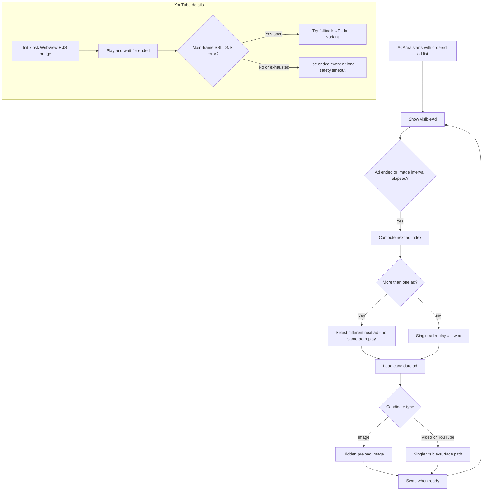
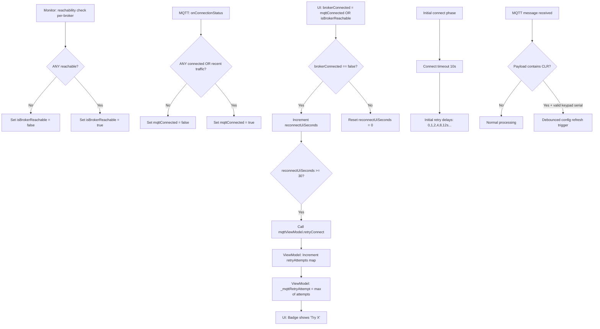
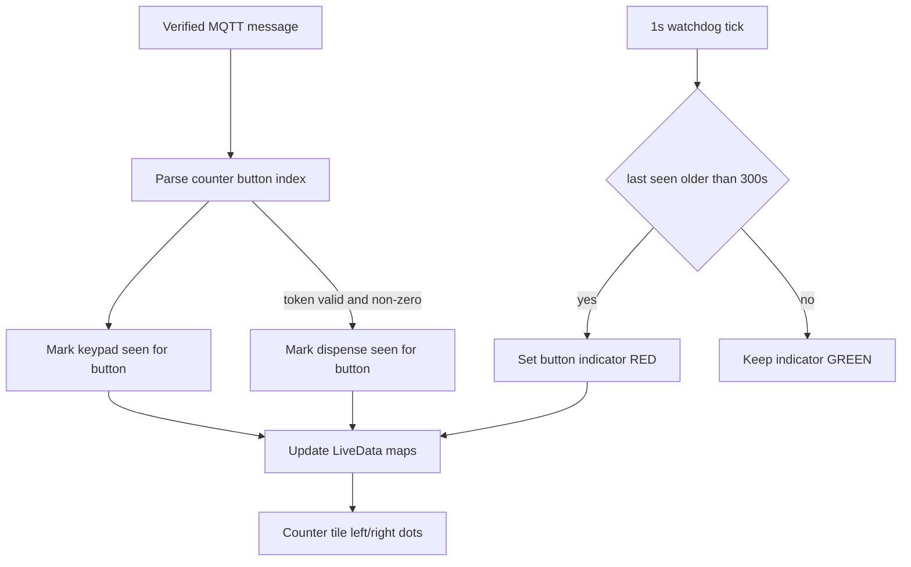

# Logic Flowcharts - CallQTV

This document details the complex logic flows for ad-looping and multi-broker connectivity.

## 1. Ad Rotation and YouTube Playback Flow

This flow ensures ads play in strict sequence and transition without user intervention.

## 2. Multi-Broker Connectivity & Retry Sync

This flow handles multiple MQTT brokers and ensures the retry UI is accurate.

## 3. Per-Counter Connection Indicators

