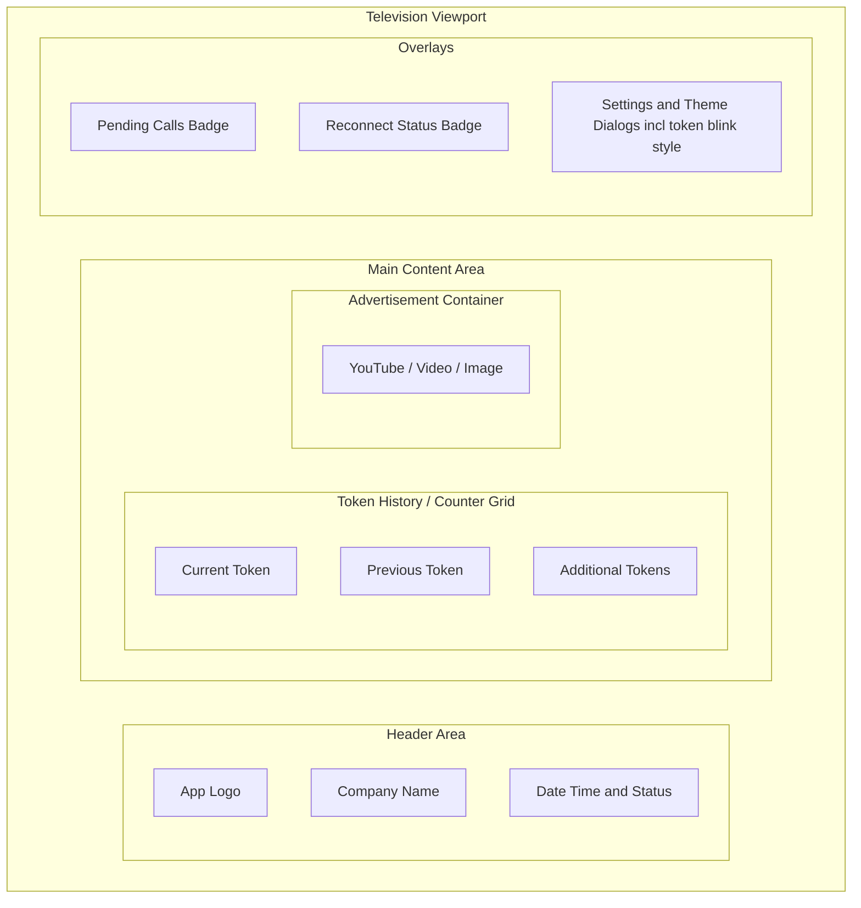
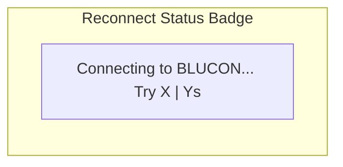
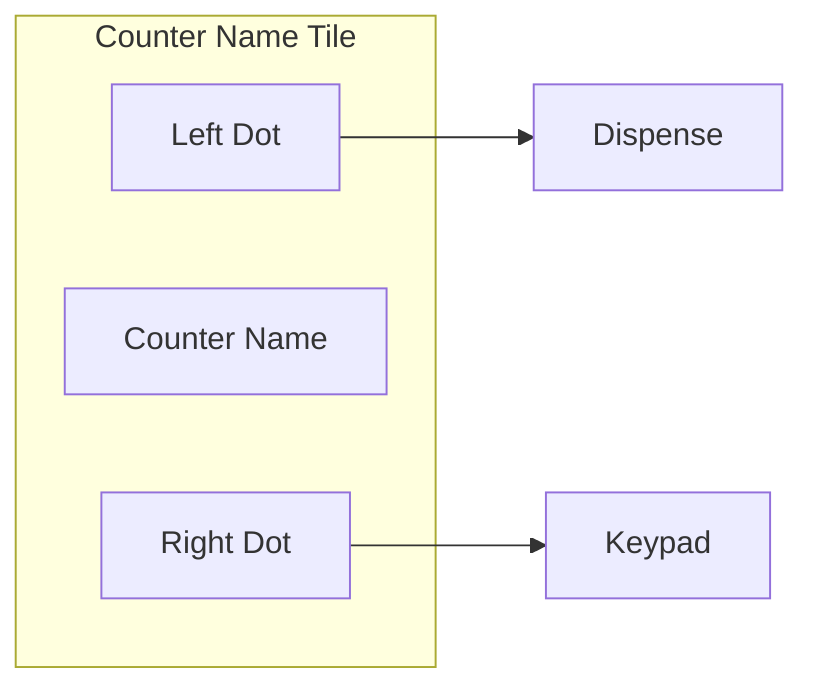
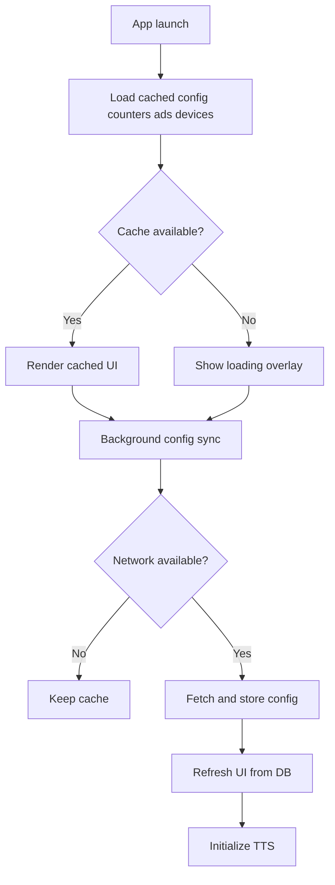
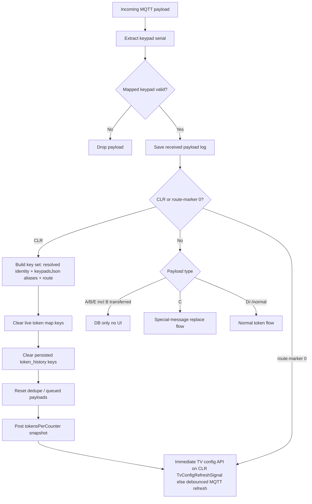
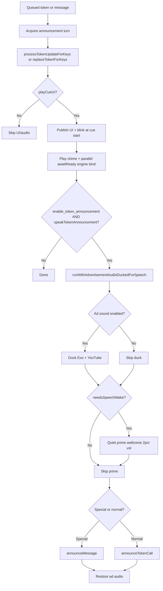
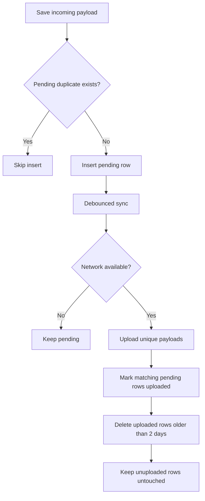

# CallQTV Master Documentation

This file is the **canonical** reference for architecture, product behavior, MQTT/CLR, announcements, theming, ads, diagnostics, and QA. Split documents below mirror sections for easier review; when they disagree, **this file wins**.

### 1.0 Document map

| Document | Use when you need |
|----------|-------------------|
| [MASTER_DOCUMENTATION.md](./MASTER_DOCUMENTATION.md) | Full behavior, edge cases, changelog (this file) |
| [SRS.md](./SRS.md) | Functional / non-functional requirements tables |
| [WIREFRAMES.md](./WIREFRAMES.md) | Screen layout and settings/picker wireframes |
| [SRS_FLOWCHARTS_WIREFRAMES.md](./SRS_FLOWCHARTS_WIREFRAMES.md) | Startup, MQTT, announcement, upload, picker flows |
| [ARCHITECTURE_AND_WORKFLOW.md](./ARCHITECTURE_AND_WORKFLOW.md) | Layers, components, MQTT→UI, CLR, API summary |
| [SOURCE_CODE_DOCUMENTATION.md](./SOURCE_CODE_DOCUMENTATION.md) | Package/class index and “where to change” |
| [QA_VALIDATION_CHECKLIST.md](./QA_VALIDATION_CHECKLIST.md) | Acceptance test checklist |
| [REBUILD_PROMPT.md](./REBUILD_PROMPT.md) | Greenfield rebuild / handoff spec |

## 1. Documentation Scope
- App purpose: Android TV queue display and digital signage application.
- Core functions:
  - Real-time token updates over MQTT
  - Config-driven display, audio, and announcement behavior
  - Advertisement playback for image, video, GIF/WebP, and YouTube
  - License/registration validation
  - Diagnostics and support export

## 2. Architecture Summary

### 2.1 Main Layers
- `ui`
  - Compose screens, dialogs, display rendering, ad area, settings
- `viewmodel`
  - UI state, MQTT lifecycle, config loading, token processing
- `data`
  - Room persistence, Retrofit APIs, repositories
- `utils`
  - Parser (`SemanticMqttParser`: fixed `$...*` protocol including types `A`–`E`, `B` transferred, `C`, `D`, `-`), announcer, ads, logging, helpers
  - `DiagnosticsExporter`: Settings → System **Export Logs/Config Snapshot** (ZIP under `CALLQTV_EXPORT/`; see §3.11)
  - `ThemeColorManager`: **`ThemePrefs`** (SharedPreferences) — app theme / counter / token **colors** (solids and **`GRADIENT:#hex1,#hex2,…`** strings), **`colorForMaterialPrimary`** for Material3 `primary` (gradient → **first stop**), **`getBackgroundBrush`** (vertical gradients for counter/token), **`getTickerStripBackgroundBrush`** (horizontal gradients for scrolling footer), **`notificationSoundOptions`** (~51 chime keys; validated on read/write), **brush caches** for picker performance, **token blink mode**

### 2.2 Core Components
- `TokenDisplayActivity`
  - Main display surface for counters, tokens, ad area, overlays, reconnect badge
- `TokenDisplayViewModel`
  - Cached-first configuration load, background config sync, ad preparation
  - Subscribes once to `MqttViewModel.configRefreshRequests` (`Channel` of `TvConfigRefreshSignal`): on each signal runs `loadData(mqttViewModel, forceShowOverlay = signal.forceImmediate)`. Non-CLR MQTT refresh signals use `forceImmediate = false` and are **throttled** to at most once per **30s** (`MQTT_REFRESH_MIN_INTERVAL_MS`). **CLR** uses `forceImmediate = true`, which **bypasses** that throttle and uses `forceShowOverlay = true` so the run matches the Settings **Refresh** control (full `fetchAndCacheTvConfig`, counters, ads, devices, MQTT reconnect, keypad cache invalidation).
- `MqttViewModel`
  - MQTT broker lifecycle
  - Keypad serial validation from DB-mapped records (`connected_devices` cache)
  - Fixed/legacy payload parsing and routing
  - Token update queueing and announcement sequencing
  - `configRefreshRequests`: bounded **`Channel`** (capacity **16**, `DROP_OLDEST`); `requestConfigRefresh(reason, forceImmediate = false)`. **CLR** calls with `forceImmediate = true` (always enqueued, no **15s** `CONFIG_REFRESH_DEBOUNCE_MS` gate). Other triggers (e.g. route-marker / 17th-char refresh) stay debounced on the MQTT VM side.
  - **`tokenUpdateChannel` / `tokenReplaceChannel`**: capacity **128**, `DROP_OLDEST`; `enqueueTokenUiEvent` + `onUndeliveredElement` keep `announcementQueueSize` aligned when oldest events are dropped under flood.
  - **`CounterRouteLookupCache`**: 5-minute TTL cache for `resolveCounterIdentityFromSerial` (key = normalized SN + route); invalidated via `invalidateCounterRoutingCache()` (also from `invalidateKeypadSerialCache()` and full history clear).
  - **`CLR` handling**: clears in-memory token map keys and `token_history` for resolved counters; merges keys from `tv_config.keypadsJson` (keypad SN → `counters[]`) so UI keys (`counter_id`, `name`, `default_name`, `button_index`) align with `TokenDisplayActivity` storage; matches route using `keypad_index` **or** `button_index` on keypad counter rows; if route-specific match finds no row, **all counters listed under that keypad SN** are cleared; always posts `tokensPerCounter` after a CLR attempt; runs clear whenever CLR validates and a serial is known (even if `extractClearPayloadInfo` is null); then requests **immediate** TV configuration refresh (see above)
- `TvConfigRepository`
  - Fetches config, maps response, updates Room transactionally
- `MqttPayloadLogRepository`
  - Saves valid payload logs with received/displayed timestamps
  - Uploads to `/api/external/token-report`
  - Cleans uploaded rows older than 2 days only
- `TokenHistoryRepository`
  - Persists newest-first token history per counter for UI restore
  - Supports full clear and per-counter clear
- `KeypadPayloadParser`
  - Extracts keypad serials from:
    - fixed payloads like `"$0PA-AeCAL0K0001lo-0008*"`
    - **`000-` CLR frames**: `"$000-<11-char-keypad-SN><token-digits>CLR…*"` — the SN is always `body[4..14]` after `000-` (e.g. `"$000-AbCAL0K000303CLR0*"` → SN `AbCAL0K0003`, token digits `03`, route digit = character immediately before `CLR`, here `3`). Token digit run length before `CLR` is **not** fixed (two or more digits supported).
    - supported short-wrapper payloads like `"$0Je-AdCAL0k0071010001*"`

### 2.3 MQTT payload path to UI (summary)
- `MqttClientManager.onMessageReceived` → trim → `rawMessageQueue` (bounded) → `viewModelScope` on **Default** dispatcher for validation / CLR / `parseMqttMessage`.
- Verified payloads: `_receivedMessage` / `_lastPayload` **LiveData**; `parseMqttMessage` → `SemanticMqttParser` → **`resolveCounterIdentityFromSerial`** (`CounterRouteLookupCache`) → **`tokenUpdateChannel`** or **`tokenReplaceChannel`** (capacity **128**, drop-oldest; `TokenUiEvent`: counter route, token text, raw payload, VIP flag).
- `TokenDisplayScreen` **`LaunchedEffect` + `receiveAsFlow().collect`** on each channel (serialized with **`announcementMutex`**): resolve `CounterEntity` via **`findCounterEntityForMqttRoute`** (`MqttCounterRouting.kt` — matches **`button_index`**, then **`keypad_index`**), compute **storage keys** (`button_index` primary, `keypad_index` fallback), `processTokenUpdateForKeys` / `replaceTokenForKeys`, chime/TTS, `publishTokensSnapshot()` → **`tokensPerCounter` LiveData**; Compose **`CountersArea`** reads lists via **`getTokensForCounter`** (same alias order).
- **`MqttViewModel.resolveCounterIdentityFromSerial`**: for **normal token / special-message** payloads, resolves the counter from **`keypad_sn` only** (via `KeypadPayloadParser` / `SemanticMqttParser.parseFixedPayload` serial); **fixed-frame index 18 (1-based) is part of the 11-char serial, not `keypad_index`**. When a keypad has one `counters[]` row, that row is used; when several, the first row that matches a Room `CounterEntity` is used. **`CLR`** still uses the route digit **immediately before `CLR`** (and optional `keypad_index` match) when present. Emits **`storageKey`** preferring **`button_index`**. **`saveTokenRecord`** matches counters by id, name, default name, and codes (not code-only).

## 3. Product and Runtime Behavior

### 3.1 Startup and Configuration
- **Storage permissions (gate):** `StoragePermissionHelper.runWhenStorageAccessReady` blocks progression until runtime storage (and **All files access** on API 30+ when required) is granted. **`SplashScreenActivity`** does not start license check / navigation until granted; **`TokenDisplayActivity`** does not call `loadData` until granted (overlay: “Storage permission is required…”); **`CustomerIdActivity.navigateToMainIfNeeded`** waits for storage before opening main display. **`onActivityResumed`** re-prompts if still denied.
- Cached config, counters, ads, and devices are loaded first to reduce startup wait.
- If cache exists, the UI renders immediately while config sync continues in background.
- If cache is absent, a loading overlay is shown until data is available.
- **Manual Retry** (config unavailable, pending approval, license expired, Settings Refresh): `loadData(..., forceShowOverlay = true)` sets `_isLoading` **synchronously** before cancelling any in-flight load; `activeConfigLoadId` ensures a cancelled job’s `finally` cannot clear loading for a newer retry. **`AnimatedLoadingOverlay`** is composed **on top of** error dialogs while `isLoading` is true.
- TTS engine binding can start as soon as `tv_config` is known (including cached config during API fetch); the **“Preparing voice engine…”** overlay is shown only when the audio language changes during an active config load, not for the whole loading overlay.

### 3.2 MQTT Token Processing
- MQTT payloads are validated by extracting keypad serial from the payload and matching it against DB-mapped keypad/device data.
- Valid payloads are saved with received timestamp.
- Displayed timestamp is updated when content is actually rendered in the UI.
- Fixed payload type behavior (index 4 in the `$...*` fixed frame; see `SemanticMqttParser.parseFixedPayload`):
  - `A` / `E`: DB-only, no token UI update (payload log / records path only)
  - `B`: **transferred token** — same as `A`/`E` (DB-only, **not** shown on the token UI)
  - `C`: special-message mode, full token area replace, centered, blinking
  - `D`, `-`, and other normal token types: standard token flow; **`D`** (index 4) = VIP/emergency → always **`ER-{token}`** on screen and **`ER`** in TTS (see §3.4.1), independent of `enable_counter_prefix`

### 3.3 `CLR` Behavior
- Valid `CLR` payload (keypad serial passes `isValidKeypadMessage`) triggers a clear pass and an **immediate** TV configuration sync: `requestConfigRefresh(..., forceImmediate = true)` → `TvConfigRefreshSignal(forceImmediate = true)` so **`TokenDisplayViewModel`** runs **`loadData(..., forceShowOverlay = true)`** without the usual **30s** MQTT-refresh throttle (same configuration API path as the Settings **Refresh** button). Other MQTT-driven config hints remain **debounced** on the MQTT VM (**15s**, `CONFIG_REFRESH_DEBOUNCE_MS`) and **throttled** in the display VM (**30s**) when `forceImmediate` is false.
- **Route resolution**: For `000-` CLR frames, the route index is the **single character immediately before** the substring `CLR` in the full trimmed payload (typically the last digit of the token run). Counter resolution prefers `keypadsJson` keypad → `counters[]` where `keypad_index` **or** `button_index` matches that route; falls back to `CounterEntity.keypad_index` / `button_index` in Room when needed.
- **Keys cleared**: In addition to `ResolvedCounterIdentity` keys, the app collects **every plausible `internalTokenMap` key** for counters mapped to the keypad SN in `keypadsJson` (config fields + matched `CounterEntity` aliases). If no `counters[]` row matches the route digit, **all counters under that keypad SN** in config are cleared so the UI does not keep stale tokens when indices disagree.
- `CLR` clears:
  - current live token state for matched keys in `internalTokenMap`
  - persisted `token_history` rows for those counter keys
  - **`vipEmergencyTokensByKey`** entries for those counter keys (VIP **ER** markers)
  - recent dedupe / queued-payload timestamps for that serial (route-aware when route is known; serial-wide for queued payloads when route is blank)
- **`LiveData`**: `_tokensPerCounter` is updated after CLR even when no in-memory keys matched (history may still have been cleared).
- This prevents old pre-clear tokens from staying on screen, blocking the next valid token, or reappearing after app restart when config and map keys stay aligned.
- **Operational note**: If `keypadsJson` is missing the keypad SN or an empty `counters` array, CLR may log that no map keys were found — fix server config for that MAC/customer.

### 3.4 Fixed Payload Routing
- **Frame layout** (`SemanticMqttParser.parseFixedPayload`, 1-based indices): `$` … type at **4** (`A`/`B`/`C`/`D`/`-`) … **11-char keypad serial** at **6–16** (Kotlin `substring(5, 16)`) … four-digit token at **20–23** (`substring(19, 23)`). **Index 18 is inside the serial**, not a `keypad_index` route digit (e.g. `$0NV-AbCAL0K000625-0002*`).
- **Token UI routing:** `parseMqttMessage` → `resolveCounterIdentityFromSerial(serial)` — **`CounterRouteLookupCache`** on hit; else lookup `tv_config.keypadsJson` by **`keypad_sn`** only on IO (no payload digit → `keypad_index` match for normal flow).
- **`TokenUiEvent.counter`** is the canonical **`button_index`** storage key when configured.
- **`TokenDisplayActivity`** resolves the visible row with **`findCounterEntityForMqttRoute`** (`button_index` first, then **`keypad_index`** fallback on the storage key).
- Persistence still uses canonical per-counter keys (`internalTokenMap` / `token_history`) so history remains stable across aliases.
- Supported short/fixed keypad payloads continue to work after a clear.

### 3.4.1 On-screen token label (`token_format` + counter prefix)
- **`tv_config.token_format`**: patterns like **`T1`** / **`T2`** set **digit width only** (zero-padding). They do **not** add a literal **`T`** on screen (token `2` + `T1` → **`2`**, not `T2`).
- When **`enable_counter_prefix`** is on, display is **`{counter.code}-{formattedToken}`** (e.g. `NU-2`), using `CounterEntity.code` / `default_code`.
- **VIP/emergency** (fixed-protocol index 4 = **`D`**): any slot whose **raw** token value was received as VIP shows **`ER-{formattedToken}`** and TTS spells **`ER`** before the token, **even when** `enable_counter_prefix` is off (`VIP_EMERGENCY_COUNTER_PREFIX`, `tokenUsesVipEmergencyPrefix` in `TokenDisplayActivity.kt`).
- **`MqttViewModel`** keeps a **`Set<String>`** of VIP raw tokens per counter map key (`vipEmergencyTokensByKey`); marking survives when the token moves to a **previous** slot. Arrival of a later **normal** token does **not** remove VIP markers for earlier VIP tokens still in history. Markers are pruned when the token leaves the trimmed history list or the counter is cleared (`CLR` / full clear).
- Implemented in **`formatTokenByPattern`** / **`CounterTokenSlot`**; tests: **`TokenFormatTest`**, **`VipEmergencyTokenPrefixTest`**.

### 3.5 Announcement Behavior
- Token UI events are processed under **`announcementMutex`** so chime/TTS do not overlap and **the next token cannot start until the previous announcement finishes** (mutex held through TTS `onDone`; no fixed speech timeout).
- **`MqttViewModel.processTokenUpdateForKeys`** returns **`TokenUiProcessResult`** (with `publishImmediately = false` in the UI collector; snapshot published from `TokenDisplayScreen`):
  - **`playCueUi`**: `true` when the token map changed, VIP/emergency overlay changed, or the primary token is eligible for a **re-call** (same token at top after **>10s**). Drives **chime**, **`publishTokensSnapshot`**, and **blink** in `TokenDisplayScreen`.
  - **`speakTokenAnnouncement`**: `true` only on primary-key rules (new/moved token, or re-call after **10s**). Drives **TTS** when `enable_token_announcement` is on.
- **Chime** therefore runs for more UI updates than TTS (e.g. fallback-key sync, VIP overlay-only change, `__MSG__` list cleanup at slot 0) — not only when speech fires.
- **`replaceTokenForKeys`** (type `C`) always runs chime + publish when replace succeeds.
- **Current token** tile update happens at **chime cue start** (`playTokenChime` `onAudioStart` + one-shot fallback `publishTokenTile()`).
- **Next token** tile update waits until the previous token’s **`announcementMutex`** turn completes (including full TTS when `speakTokenAnnouncement` is true).
- **Per-token order (announcements on):** start `async { awaitReady() }` → `processTokenUpdateForKeys` → **`withTimeoutOrNull(12s)`** await warm (if speaking; logs warning and **still attempts TTS** on timeout) → `playTokenChime` → publish tile + blink → duck/prime/speak → release mutex.
- **Chime → TTS:** `awaitReady()` (bind + silent poke + synthesis prime when needed) overlaps map update and chime start; collector **does not** wait for the full custom chime clip. Custom URL chimes may still play in the background until `MediaPlayer` completion.
- **Normal tokens (spoken phrase)**: space-separated — `Token`, optional **spelled counter prefix** (letters/digits with spaces when counter prefix is enabled), token label, optional **counter display name** when `enable_counter_announcement` is on (same ordering as on-screen emphasis).
- **Special messages (`__MSG__` / type `C`)**: spoken as **message** then optional **counter name** (single space, no comma) when counter announcement is enabled.
- If counter prefix is enabled for normal tokens, the prefix is part of the same utterance as the token (spelled with spaces between characters).
- **VIP/emergency (`D`)**: TTS always spells **`ER`** before the token when `isVipEmergency` is true, even if `enable_counter_prefix` is off (`TokenDisplayScreen` collector).
- **Advertisement sound (`ThemePrefs` `enable_ad_sound`)**: `runWithAdvertisementAudioDuckedForSpeech` lowers **ExoPlayer** and **YouTube `WebView`** video volume **before** synthesis prime and the real announcement. Volumes restore on utterance completion / cancellation (`TokenAnnouncementAdAudio`, `MediaEngine`). If ad sound is off, ducking is skipped and synthesis prime runs immediately before speak (see §3.5.1).
- Special messages: use `TokenAnnouncer.announceMessage` path; blink using existing current-token blink timing.
- Identical raw payloads received within 10 seconds are announced only once.

#### 3.5.1 TTS implementation notes (`TokenAnnouncer`)

**Early engine warm (`TokenDisplayViewModel` + UI)**

- `warmTokenAnnouncerIfEnabled()` calls `TokenAnnouncer.setAnnouncementsEnabled(true)` and **`warmUp(..., performPoke = true)`** (non-blocking; synthesis prime runs in background) when `enable_token_announcement` is on:
  - Before cache clear on launch (last session’s cached language, while config API runs).
  - On every `applyUiFromSnapshot` when config is applied from cache or API.
- `TokenDisplayScreen` `LaunchedEffect(config…)` runs **`launch { awaitReady(...) }`** in the background (does not block Compose); shows “Preparing voice engine…” only when audio language changes during load.

**APIs**

| API | Purpose |
|-----|---------|
| `warmUp` / `initialize` | Bind `TextToSpeech` on main thread; `performPoke = true` → poke + **async** prime, then **`onReady(true)` immediately** (does not wait for prime to finish) |
| `awaitReady` | Suspend until engine is **bound**; optional poke; if **`primeSynthesis = true`**, then `awaitSynthesisPrimeIfNeeded()` (waits for cold prime / in-flight prime) |
| `awaitSynthesisPrimeIfNeeded` | Suspend until quiet prime finishes when `needsSpeechWake()`, or queue on `pendingAfterPrime` if `synthesisPrimeInFlight` |
| `announceTokenCall` / `announceMessage` | Real speech; `skipSynthesisPrime` when prime already ran in duck path |
| `ensureHeartbeatScheduled` | Start 3 s keep-alive loop if not already running |

**Engine bind vs synthesis warm**

- On first **`TextToSpeech` init success**, **`finishInitAttempt(true)` runs immediately** so `warmUp` / `awaitReady` waiters are not stuck; **`primeSpeechSynthesisOnMain`** runs right after (async). Deferring `finishInitAttempt` until prime completed caused the first token to show on screen with **no speech** on some TVs.
- **`synthesisPrimeInFlight`** + **`pendingAfterPrime`** serialize overlapping prime requests; concurrent `awaitSynthesisPrimeIfNeeded()` calls wait for the active prime.

**Synthesis prime (cold voice load)**

- Constant `SYNTHESIS_PRIME_PHRASE` = **`"wellcome"`** at **`PRIME_VOLUME` (0.01)** — loads the active voice without a loud duplicate announcement.
- **Token path:** `needsSpeechWake()` when no real speech yet, or idle **> `SPEECH_WAKE_IDLE_MS` (60 s)** since last `token_*` / `msg_*` or last prime.
- **Idle keep-warm:** heartbeat calls `keepSynthesisWarmDuringIdle()` — quiet prime at most every **`IDLE_SYNTHESIS_KEEP_WARM_INTERVAL_MS` (15 s)** while announcements are enabled (skipped when `tts.isSpeaking`).
- **Also primes:** right after TTS init (async), on `warmUp(..., performPoke = true)` when engine already ready (async), and in `awaitSynthesisPrimeIfNeeded()` before real speech when cold.
- **Debounced:** at most once per **`PRIME_DEBOUNCE_MS` (4 s)**; **`PRIME_TIMEOUT_MS` (4.5 s)** fallback if prime utterance never completes.
- **With ad sound on:** extra prime in `runWithAdvertisementAudioDuckedForSpeech` **after** duck; `announce*` with `skipSynthesisPrime = true`.
- **With ad sound off:** prime in `speakRawNowOnMain` via `runOnMainAfterSpeechWake` when cold (`skipSynthesisPrime = false`).
- Silent **heartbeat** (`playSilentUtterance` every **3 s**) keeps the engine **bound**; audible prime keeps **synthesis** loaded on many TV stacks.

**Speech text**

- Normalized (NFC, strip controls, collapse whitespace) before `speak`.
- Letter-spaced runs optionally collapsed (`collapseLetterSpacedRuns`).
- Long ALL-CAPS words in special messages may be lowercased for word pronunciation.
- Optional debug log when input still contains `__MSG__` (tag `TokenAnnouncer`).

#### 3.5.2 Token UI collector (`TokenDisplayScreen`)

Under **`announcementMutex`**, each `tokenUpdateChannel` / `tokenReplaceChannel` event:

1. If `enable_token_announcement`: `async { TokenAnnouncer.awaitReady(performPoke = true) }` (starts **before** `processTokenUpdateForKeys`).
2. `processTokenUpdateForKeys(..., publishImmediately = false, isVipEmergency = pair.isVipEmergency)`.
3. If `playCueUi`: **`withTimeoutOrNull(12_000)`** on `awaitReady` when speaking → **`playTokenChime`** (awaited) → **`publishTokenTile`** at `onAudioStart` + fallback → TTS until `onDone` → release mutex (next token blocked until TTS completes).
4. **`publishTokenTile`**: `publishTokensSnapshot`, `markAsAnnounced`, `markPayloadDisplayed`, blink trigger.
5. **VIP TTS:** `spokenPrefix` = spelled **`ER`** when `pair.isVipEmergency`, else counter code only if `enable_counter_prefix`; passed to `announceTokenCall` as `spelledCounterPrefix`.
6. **`TokenDisplayActivity.onDestroy`**: `TokenAnnouncer.shutdown()` only when `isFinishing` (transient teardown keeps TTS warm).

### 3.6 Special Message Rendering
- Payload type `C` uses `button_strings` value substitution.
- It replaces the token area for that counter, rather than joining the normal token list.
- If normal tokens later arrive, stale special placeholders are suppressed from the list.
- **`TokenCard` (`specialCounterMessage = true`)**: Multiline counter messages use **extra horizontal/vertical padding** (scaled with UI `scale`), **relaxed line height** (~1.42× font size) so wrapped lines (e.g. two-line ward messages) are readable and not clipped; auto-fit measurement uses the same line height so chosen font size matches rendered layout.

### 3.7 Connectivity Behavior
- Supports multiple MQTT brokers.
- Effective connectivity is treated as active when:
  - any broker is connected, or
  - recent MQTT traffic is still being observed
- Reconnect badge behavior:
  - shows `Connecting to BLUCON...`
  - shows retry attempt (`Try X`)
  - uses a 30-second retry cycle for reconnect handling

### 3.8 Counter Indicators
- Each counter-name tile has two dots:
  - left: dispense connectivity
  - right: keypad connectivity
- Default state is red.
- Relevant MQTT activity turns the dot green.
- After 5 minutes of inactivity, the dot returns to red.

### 3.9 Local display preferences (Settings, `ThemePrefs`)
- Stored on device (not part of server `tv_config` JSON). SharedPreferences name **`ThemePrefs`**. Implementation: **`ThemeColorManager`** (`ThemeColorManager.kt`) plus direct reads/writes in **`TokenDisplayActivity`** for some boolean toggles.

#### 3.9.1 App theme (Material 3) vs counter/token backgrounds
- **`theme_color`:** Can be a solid `#RRGGBB` / `#AARRGGBB` or a **`GRADIENT:#hex1,#hex2,…`** entry from `ThemeColorManager.themeColorOptions`. Material3 **`ColorScheme.primary`** must be a single **`Color`**; the app uses **`ThemeColorManager.colorForMaterialPrimary(value)`**, which parses solids normally and, for **`GRADIENT:`** values, uses the **first** gradient stop as `primary` (so accents align with the start of the gradient). **`createDarkColorScheme`** still builds a fixed dark shell (e.g. background `0xFF121212`).
- **Counter / token areas:** Hex strings are passed into **`ThemeColorManager.getBackgroundBrush`**, which renders **solid** colors or **vertical gradients** for `GRADIENT:…` (same encoding as theme options).
- **Activities:** **`TokenDisplayActivity`** composes **`MaterialTheme(colorScheme = …)`** from prefs (async initial read in **`LaunchedEffect`**, then callbacks update state + prefs). **`SplashScreenActivity`** and **`CustomerIdActivity`** use **`getSelectedThemeColor`**, which delegates to **`colorForMaterialPrimary`** on the stored `theme_color` string.

#### 3.9.2 Token blink and other keys
- **Token blink style** (`token_blink_mode` in `ThemePrefs`, via `ThemeColorManager` / `TokenBlinkMode`):
  - **Whole tile blinks** (`WHOLE_TILE`, default): when `blink_current_token` is enabled in TV config, the primary token cell swaps background and text colors on the whole card (legacy behavior).
  - **Text only blinks** (`TEXT_ONLY`): same server blink flag and timing, but only the token label pulses; tile background stays on the normal token brush.
- Other `ThemePrefs` keys include **`counter_bg_color`**, **`token_bg_color`**, **`notification_sound_key`**, 24-hour clock, YouTube/offline/ad-sound toggles, etc. **`getBackgroundIntensity`** exists in `ThemeColorManager` as a fixed constant (reserved / legacy hook).

#### 3.9.3 Notification chime (`notification_sound_key`)
- **Catalog:** `ThemeColorManager.notificationSoundOptions` — single list of **~51** keys/labels (dings, doubles, soft, alerts, bells, church, pings, long, chimes, high/low beeps, misc tones). Each key must match a branch in **`playSystemTone`** (`TokenDisplayActivity.kt`).
- **Persistence:** `getNotificationSoundKey` / `setNotificationSoundKey` validate against the catalog; unknown keys fall back to **`ding`**.
- **Playback:** `playTokenChime` — one cue per event: per-counter URL, else global `tokenAudioUrl`, else system tone from prefs. Used for token updates and preview in **Notification sound** settings.

#### 3.9.4 Settings color pickers (`PresetColorDialog`)
- **Entry:** Settings → Display — **App Theme**, **Counter Background**, **Token Background** (and **Audios** → **Notification sound** via `NotificationSoundDialog`).
- **Implementation:** `PresetColorDialog(title, options, selectedHex, …)` — shared grid for theme (`themeColorOptions`) and backgrounds (`backgroundOptions`).
- **Performance:** Brushes are cached in `ThemeColorManager` (`backgroundBrushCache`); on open, first **~35** swatches are warmed on a **background** thread (with `yield()`), then the grid appears; remaining swatches warm incrementally to avoid TV **ANR**.
- **Lazy grid keys:** `"${option.name}_$index"` — **not** `hexCode` alone (duplicate hex values such as **Dark Green** and **Emerald** both `#1B5E20` would crash Compose if keyed by hex).
- **TV focus:** `PresetColorSwatchTile` uses `focusable` + `clickable` with shared `MutableInteractionSource`; parent **`focusedIndex`** tracks D-pad focus; grid uses **`focusGroup()`**. On open: scroll to **`selectedHex`**, request focus on the selected swatch.
- **Visual states:**
  - **Saved selection:** white border + corner dot (when not focused).
  - **D-pad focus:** gold ring (5dp), black outline, scale ~1.16×, white inner stroke.
- **Notification sound dialog:** same `focusedIndex` + focus ring pattern on `OutlinedButton` items.

#### 3.9.5 Scrolling footer (ticker strip)
- **Composable:** `ScrollingFooter` in `TokenDisplayActivity` — `SeamlessTickerView` marquee when `scroll_enabled` is on and `scrollTextLinesJson` has lines.
- **Scroll behavior:** Footer ticker loops **continuously** (no idle pause between loops). Counter **name** headers use `CounterNameTickerView`, which still pauses **3s** at each loop start (`COUNTER_NAME_MARQUEE_RESTART_PAUSE_MS`) so long names remain readable.
- **Background:** Uses stored **`theme_color`** string passed as **`appThemeHex`** (from `TokenDisplayActivity` → `TokenDisplayContent` → `TokenDisplayFooter`), not a fixed color.
- **`getTickerStripBackgroundBrush(hex)`:** For **`GRADIENT:…`**, **horizontal** multi-stop gradient across the wide bar; for **solid** hex, horizontal blend `lerp(#121212, primary, 0.52→0.78)` so white ticker text stays readable.
- **Material theme:** Footer strip is independent of `MaterialTheme.colorScheme` surface; it follows the user’s theme/gradient preference directly.

### 3.10 Advertisement Behavior

#### 3.10.1 Configuration (`tv_config` + local prefs)

| Field / pref | Role |
|--------------|------|
| `show_ads` | `"on"` / `"off"` — master switch |
| `ad_files` | Ordered list of URL/path strings → `AdFileEntity` rows |
| `ad_interval` | Seconds between **image** / static **web** slides (min 1, default 5); video/YouTube advance on end |
| `ad_placement` | `left`, `right` (landscape default), `top`, `bottom` (portrait) |
| `no_of_counters` / layout | Affects ad pane share (see §3.10.3) |
| `ThemePrefs.allow_youtube_ads` | When false, YouTube entries are skipped |
| `ThemePrefs.enable_ad_sound` | Video + YouTube volume; enables TTS ducking when on |
| Offline ads | `PreferenceHelper` + `AdDownloader` → `Download/CALLQTV_ADV/` |

Ads are sorted by **`position`** (array index in `ad_files`). Multiple ads use **strict round-robin** (`AdArea` in `TokenDisplayActivity.kt`).

#### 3.10.2 Supported media types (`AdMediaType`)

Classification: `resolveAdMediaType()` / `fastInferMediaType()` in `TokenDisplayActivity.kt`. Playback: `AdUnifiedPlayer.kt`.

| Type | Detection | Playback |
|------|-----------|----------|
| **Image** | `.jpg`, `.jpeg`, `.png`, `.gif`, `.webp`, `.bmp`, `.svg` | Coil `AsyncImage`, `ContentScale.Fit` |
| **Video** | `.mp4`, `.webm`, `.mkv`, `.mov`, `.m3u8`, `.mpd`, `.avi`, `.ts`, … | Media3 ExoPlayer on shared `TextureView` |
| **YouTube** | `youtube.com`, `youtu.be`, `youtube-nocookie.com`, or bare 11-char video id | Shared `WebView` kiosk (`YouTubeAdPlayer`) |
| **Web** | Other `http(s)` URLs | `WebLinkAdPlayer`; live URLs (`.m3u8`, `.mpd`, `live`, …) use ExoPlayer |

**WMV** (`.wmv`): WebView first, then ExoPlayer fallback (`isWmvAdPath`).

**Display rule:** All types use **fit inside the pane** (letterboxing if aspect ratio differs). Ad region is **display-only** (no touch interaction).

**YouTube:** Kiosk-style page, minimal chrome, pinned video id, SSL/DNS/embed restriction fallbacks, optional max duration (`youtube_ad_max_seconds`, default 120s).

**Failures:** Watchdog timeouts skip to next ad; single-ad failures remount player token.

#### 3.10.3 Ad pane layout (screen share)

Not a fixed pixel size — **`BoxWithConstraints`** in `AdArea` measures the pane each layout pass.

| Condition | Ad weight | Counter weight |
|-----------|-----------|----------------|
| `show_ads` off or empty `ad_files` | 0% | 100% |
| ≤ 2 counters (`no_of_counters` / layout) | **50%** | 50% |
| 3+ counters | **40%** | 60% |

Landscape: ad **left** or **right** (default `ad_placement` = `right`) → tall **vertical strip**. Portrait: **top** / **bottom** / sides → horizontal or vertical strip per `ad_placement`.

**Typical pane @ 1920×1080 landscape, right ad:** ~**750×900 px** (varies with header/footer).

#### 3.10.4 Viewport-aware decode (`AdViewportSizing.kt`)

**May 2026:** Scales **any source resolution** to the measured pane for speed and stability (does not add new formats).

| Component | Behavior |
|-----------|----------|
| `AdViewportSizing.fromConstraints` | Maps Compose max width/height → `AdViewportPx` |
| `AdViewportSizing.decodeTarget` | Target decode size (~6–12% headroom for DPI) |
| `MediaEngine.updateViewport` | Updates ExoPlayer track max size + bitrate on both players |
| `applyVideoTrackConstraints` | Per-clip: `setMaxVideoSize`, `setMaxVideoBitrate` scaled to pane area |
| Coil | `coilImageRequestBuilder` → `.size(w, h)`; **preload** all image ads + next candidate |
| `MediaEngine` load control | Faster start: ~**750 ms** min buffer (was ~1.5s) for quicker first frame |
| `applyFitCenterTransform` | Video texture letterboxed to texture view |

**Video:** Adaptive/HLS picks a rendition ≤ pane pixels (not full 4K decode on a narrow strip). **4K files** still play when a suitable lower track exists.

**Images:** Decoded near pane resolution (large masters no longer decoded at full 4K by default).

#### 3.10.5 Recommended creative sizes (guidance)

No server-enforced resolution. Any size can be supplied; the app scales to fit.

| Deployment | Suggested creative aspect |
|------------|---------------------------|
| Landscape TV, side ad strip | **Portrait** 9:16 or 2:3 (e.g. 1080×1920, 800×1200) |
| Portrait TV, top/bottom ad | **Landscape** 16:9 (e.g. 1920×1080, 1280×720) |
| Video | H.264 **MP4** or **HLS**; **≤1080p**, ≤30 fps for broad TV compatibility |

#### 3.10.6 Known limitations (may not play)

| Case | Notes |
|------|--------|
| YouTube disabled in settings | Skipped |
| Private / embed-blocked / region-locked YouTube | May error → skip |
| **DRM** streams (Widevine, etc.) | Usually unsupported on TV without DRM config |
| Exotic codecs | May fail → WebView fallback or skip |
| **SVG** | Weak Coil support; HTTP may fall back to WebView |
| Broken / 404 URLs | Timeout → skip |
| Audio-only assets | No visual |
| DRM / interactive / click-required ads | Out of scope |

#### 3.10.7 Other ad behavior

- **Preload:** Next ad buffered off-screen (`candidateAd`); video uses second ExoPlayer slot without second texture when possible.
- **Offline ad sync** via `AdDownloader.syncAds`.
- One setting controls ad sound for video and YouTube.
- When ad sound is **on**, token/special **TTS ducks** ad playback (see §3.5).

### 3.11 Diagnostics snapshot export (`DiagnosticsExporter`)
- Trigger: Settings → System → **Export Logs/Config Snapshot** (`TokenDisplayActivity`); runs on a background dispatcher.
- Staging: under **`context.cacheDir/CALLQTV_EXPORT/`**, builds a dated folder `snapshot_<yyyyMMdd_HHmmss>/` (clears prior cache export scratch), copies config/log sources (`FileLogger` base, public `Download/CALLQTV_CONFIG` **File** tree, app-scoped `CALLQTV_CONFIG`), MediaStore tree copy on **API 29+** (`PublicCallqtvConfigStorage.copyPublicConfigTreeInto`), explicit error/API/backup log files, live Room DB (`callqtv.db` + `-wal`/`-shm` if present), and **`export_summary.txt`**.
- ZIP destination order:
  1. **Removable external volumes** (SD / USB when `Environment.isExternalStorageRemovable` is true for that entry): `getExternalFilesDirs(DIRECTORY_DOWNLOADS)` → **`Android/data/.../files/Download/CALLQTV_EXPORT/<zip>`** (app-writable; no SAF).
  2. **API 29+:** MediaStore **`Downloads/CALLQTV_EXPORT/<zip>`** (`exportSnapshotZipToSharedDownloads`).
  3. **Fallback:** `exportSnapshotZipToLegacyStorage` — prefers writable **public Download** `CALLQTV_EXPORT` via `getExportParent`, then **`tryWriteSnapshotZip`** to app-scoped external/files (`getAppScopedExportRoot`); on write failure, retries app-scoped path.
- After success, staging under **`cacheDir/CALLQTV_EXPORT`** is cleared; UI shows a **Toast** with the resolved path/message.
- **Note:** A system **“Failed to copy files” / read-only** dialog usually comes from the **Files** app when copying the ZIP to another volume (e.g. read-only USB), not from this exporter’s Toast strings.

## 4. Supported MQTT Payload Examples

### 4.1 Clear Payload (`000-` CLR frame)
- Examples:
  - `"$000-AbCAL0K000101CLR0*"` — SN `AbCAL0K0001`, token digits `01`, route digit `1`
  - `"$000-AbCAL0K000303CLR0*"` — SN `AbCAL0K0003`, token digits `03`, route digit `3`
- Behavior:
  - validates extracted **11-character** keypad serial against mapped keypad devices
  - resolves counter(s) via `keypadsJson` + Room counters (route from digit before `CLR`; see §3.3)
  - clears live map + persisted history for resolved key set (may include **all** counters on that keypad SN when route match is ambiguous)
  - resets duplicate / queued-payload suppression for that serial/route scope
  - triggers **immediate** TV configuration API refresh (CLR path; see §3.3)

### 4.2 Normal Fixed Token
- Example:
  - `"$0PA-AeCAL0K0001lo-0008*"`
- Behavior:
  - validates keypad serial
  - resolves mapped route/button index
  - shows token `8` in the corresponding counter

### 4.3 Normal Fixed Token After Clear
- Example:
  - `"$0KJ-AbCAL0K000111-0015*"`
- Behavior:
  - remains valid after a prior `CLR`
  - is allowed through immediately
  - shows token `15` on the mapped counter

### 4.4 DB-Only Payload (`A`, `E`, or transferred `B`)
- Examples:
  - Type `A`/`E` (DB-only): any valid fixed frame with index 4 in `A` or `E`.
  - Type `B` (**transferred token**), e.g. `"$0OsBAbCAL0K000333-0005*"` or the same frame shape as other tests with `B` at index 4.
- Behavior:
  - parsed and may be recorded (payload log / token records as implemented)
  - **not** pushed to the live token UI (`PayloadAction.DB_ONLY` in `SemanticMqttParser`; `MqttViewModel` returns before token channels)

### 4.5 Special Message Payload
- Example:
  - `"$0AGCAdCAL0K0004u5-0001*"`
- Behavior:
  - resolves `button_strings` message text
  - replaces the token tile area for that counter
  - blinks and uses raw-message TTS

## 5. Software Requirements Summary

### 5.1 Token and MQTT Requirements
- Receive real-time token updates from one or more MQTT brokers.
- Display current token/counter state prominently.
- Play chime and optional TTS for new tokens.
- Support re-call after 10 seconds with fresh blink/announcement.
- Validate fixed payloads using extracted keypad serial against mapped DB records.
- Resolve UI routing by mapped button index first for valid fixed token payloads.
- Support keypad extraction for fixed, **`000-` CLR** (variable token digits before `CLR`; see `KeypadPayloadParser`), and supported short-wrapper payload shapes.
- Store `A`/`B`/`E` payloads without UI rendering (`B` = transferred token; same DB-only path as `A`/`E`).
- Render `C` payloads as special-message replace tiles.
- Render `D`, `-`, and normal types via normal token flow.
- Suppress identical payload announcements within 10 seconds.
- Update displayed timestamp when UI actually renders the content.
- Keep uploaded MQTT rows for 2 days by received time; never delete unuploaded rows.

### 5.2 `CLR` Requirements
- On valid `CLR`, trigger **immediate** full TV configuration fetch (same `loadData` / API behavior as manual Refresh), not only a debounced background hint.
- Clear the counter(s) implied by the keypad SN and route digit when mapping is unambiguous; when `keypadsJson` route indices do not match the payload digit, still clear **all counters listed for that keypad SN** so the display cannot remain stuck.
- Clear persisted token-history cache for the same key set cleared from the live map.
- Reset duplicate / queued-payload suppression appropriately for that serial (and route when known).
- Always refresh `tokensPerCounter` observers after a CLR attempt.

### 5.3 Connectivity Requirements
- Show reconnect badge when broker connectivity is lost.
- Display retry attempt and timer.
- Retry reconnect on a 30-second cycle.
- Treat connectivity as active if any broker is connected or recent MQTT traffic exists.
- Show per-counter left/right status dots for dispense and keypad activity.

### 5.4 Advertisement Requirements
- Play image, GIF/WebP, video (file + HLS/DASH), YouTube, and generic web URLs in the ad area.
- Scale all resolutions to the **measured ad pane** (viewport-aware decode; no fixed creative resolution).
- Keep ad area display-only.
- Support kiosk YouTube playback (optional disable in settings).
- Support offline ad sync to `CALLQTV_ADV`.
- Enforce round-robin ad sequencing when multiple ads exist.
- Preload image ads; minimize delay before first video frame.

## 6. Wireframes

### 6.1 Main Display Layout

### 6.2 Reconnect Badge

### 6.3 Counter Indicator Layout

## 7. Flowcharts

### 7.1 Startup + Config Flow

### 7.2 MQTT Token and `CLR` Flow

### 7.3 Announcement Flow

### 7.4 MQTT Payload Upload Flow

## 8. Engineering and QA Checklist

### 8.1 Build and Environment
- `compileSdk = 35`
- `targetSdk = 35`
- `minSdk = 21`
- Java/Kotlin target: 17

### 8.2 Validation Checklist
- Build debug app successfully; `./gradlew testCallQTVDebugUnitTest` (**44** tests).
- Validate storage permission gate on splash, main (`loadData`), and registration→main.
- Validate cached-first startup.
- Validate TTS warm-up (cached config during load; first announcement without multi-second delay after idle).
- Validate with **ad sound** on: quiet **wellcome** prime plays **after** ads duck, before the real call (not over full-volume ads).
- Validate multi-broker MQTT reconnect behavior.
- Validate per-counter indicator transitions.
- Validate:
  - `"$000-AbCAL0K000101CLR0*"` and `"$000-AbCAL0K000303CLR0*"` clear the intended counter(s) for SN `AbCAL0K0001` / `AbCAL0K0003` and route digit before `CLR`
  - `keypadsJson` contains the keypad SN and `counters[]` so CLR can resolve map keys
  - `"$0PA-AeCAL0K0001lo-0008*"` shows token `8`
  - `"$0KJ-AbCAL0K000111-0015*"` still shows token `15` after a prior clear
  - With **Advertisement sound** on, TTS ducks ad audio and restores after speech
  - Special **counter message** tile: multiline text is readable (padding + line height), not clipped
- Validate pre-clear tokens do not return after app restart.
- Validate next valid token appears normally after `CLR`.
- Validate type `B` transferred payloads do **not** change the token tile (DB-only).
- Validate Settings → Display → **Token blink**: whole-tile vs text-only behavior when `blink_current_token` is on.
- Validate **app theme**: solid and **gradient** `theme_color` — Material accents use first gradient stop; counter/token **brushes** show full **vertical** gradient where applicable; **scrolling footer** uses **horizontal** `getTickerStripBackgroundBrush`.
- Validate **notification chime** on every `playCueUi` UI update (including VIP-only / fallback-key sync), not only when TTS speaks.
- Validate VIP **ER-** prefix on **previous** token slots after a normal token arrives; VIP markers cleared on **CLR**.
- Validate config **Retry** shows loading overlay for full fetch (unavailable config, pending approval, license expired).
- Validate footer ticker scrolls continuously (no long pause between loops).
- Validate **Settings → Display** color pickers: open without ANR; D-pad **focus ring** on navigated swatch; initial focus on **current** `selectedHex`; no crash from duplicate hex (grid keys use name+index).
- Validate **Notification sound** picker: preview chime; focus on current selection.
- Validate uploaded rows older than 2 days are cleaned and unuploaded rows remain.
- Validate support export location and diagnostics behavior: with **SD/USB** mounted (`isExternalStorageRemovable`), snapshot ZIP prefers **`…/Android/data/.../files/Download/CALLQTV_EXPORT/`** on that volume; without removable storage, confirm **Downloads/CALLQTV_EXPORT** or app-scoped fallback from Toast path.
- After **CLR**, confirm **configuration API** runs (network trace or server-side version bump) and UI picks up latest counters/devices without waiting 30s.

### 8.3 Known Technical Notes
- Some AGP/Gradle patterns and properties are deprecated and should be cleaned up in a maintenance pass.

## 9. Documentation Log Note
- Application is in debug mode.
- Log file created: `error_log.txt`
- If runtime errors or unexpected behavior occur, check the error log for details.

### 9.1 Recent source-aligned updates (documentation)
- **May 2026**: **`ThemeColorManager.colorForMaterialPrimary`** — `theme_color` may be **`GRADIENT:#…`**; Material3 `primary` uses the gradient’s **first stop**; counter/token brushes still use full **`getBackgroundBrush`** gradient parsing. **`TokenDisplayActivity`** uses `colorForMaterialPrimary` for scheme build; **`getSelectedThemeColor`** aligned to the same logic.
- **May 2026**: **`TvConfigRefreshSignal`** / **`requestConfigRefresh(forceImmediate)`** — CLR requests **immediate** `TokenDisplayViewModel.loadData(..., forceShowOverlay = true)` (bypasses **30s** display-VM MQTT refresh throttle); other MQTT refresh requests remain debounced (**15s** on `MqttViewModel`, **30s** min interval on collector when `forceImmediate` is false).
- **May 2026**: **`DiagnosticsExporter`** — export ZIP tries **removable** `getExternalFilesDirs(Download)` first, then MediaStore **Downloads/CALLQTV_EXPORT**, then legacy public/app-scoped fallbacks (`tryWriteSnapshotZip`, `getAppScopedExportRoot`).
- **May 2026**: Documented **MQTT → UI** pipeline: `rawMessageQueue`, `tokenUpdateChannel` / `tokenReplaceChannel`, `announcementMutex`, `tokensPerCounter`, `getTokensForCounter` (§2.3).
- **May 2026**: Documented fixed-protocol index `B` as **transferred token**, **DB-only** (no token UI), alongside `A`/`E`.
- **May 2026**: Documented **local** token blink style preference (`ThemePrefs` / `ThemeColorManager.TokenBlinkMode`: whole tile vs text only) under Settings → Display; server `blink_current_token` still gates whether blinking runs.
- **May 2026**: Documented `TokenAnnouncer` behaviors relevant to special-message speech (normalization, letter-spaced collapse, long ALL-CAPS handling, optional debug logging).
- **May 2026**: **`KeypadPayloadParser`** — `000-` CLR frames use **dynamic position** of `CLR` (variable-length token digits before `CLR`); 11-char keypad SN is always indices `4..14` after `000-` (see §4.1 examples).
- **May 2026**: **`MqttViewModel` CLR** — key set built from `ResolvedCounterIdentity`, internal-map aliases, and **`tv_config.keypadsJson`** counter entries for the keypad SN; `button_index` on keypad counter rows participates in route match; clear runs when serial is known even if `extractClearPayloadInfo` is null; ambiguous route clears **all** counters listed for that keypad; `tokensPerCounter` always posted after CLR.
- **May 2026**: **Announcements** — normal tokens: space-separated `Token` + optional spelled prefix + token + optional counter name; special: message + optional counter name (space); **ad audio ducking** when `enable_ad_sound` is on (`TokenAnnouncementAdAudio` + `MediaEngine` in `TokenDisplayActivity`).
- **May 2026**: **Special message UI** — `TokenCard` multiline counter messages: increased padding and explicit **line height** (~1.42×) with matching auto-fit measurement to reduce clipping and cramped lines.
- **May 2026**: **`TokenUiProcessResult`** — **`playCueUi`** vs **`speakTokenAnnouncement`**; chime + blink for all qualifying UI/map/VIP changes; TTS only when primary-key announce rules pass (§3.5).
- **May 2026**: **`ThemeColorManager.notificationSoundOptions`**, brush caches, **`getTickerStripBackgroundBrush`**, **`PresetColorDialog`** / **`PresetColorSwatchTile`** (TV focus, throttled warm, unique grid keys) (§3.9.3–§3.9.5).
- **May 2026**: **`MqttCounterRouting.kt`** — shared `findCounterEntityForMqttRoute` / `mqttRouteMatches*` helpers; UI channel handlers use keypad_index fallback when storage key is not a button_index.
- **May 2026**: Room **v17** — `mqtt_payload_logs` table; **`MqttPayloadLogRepository`** + **`TokenReportRequest`** upload; **`FlexibleIntDeserializer`** on API counter index fields.
- **May 2026**: **`PublicCallqtvConfigStorage`**, expanded **`DiagnosticsExporter`** / **`FileLogger`**; **`MyApplication`** non-fatal exception filtering.
- **May 2026**: Unit tests — `MqttCounterRoutingTest`, `TvConfigParsingTest`, `SemanticMqttParserTest`, `KeypadPayloadParserTest`, `TokenAnnouncerSpeechTest`, `TokenFormatTest`.
- **May 2026**: Source index — [SOURCE_CODE_DOCUMENTATION.md](./SOURCE_CODE_DOCUMENTATION.md) refreshed (~91 main Kotlin files, Room v17, 9 unit test classes).
- **May 2026**: **`AdViewportSizing.kt`** — `BoxWithConstraints` in `AdArea`; Coil decode + preload at pane size; ExoPlayer `updateViewport` + per-clip track/bitrate caps; faster ad buffer; §3.10 expanded (types, pane layout, limitations).
- **May 2026**: **MQTT token routing** — normal/special fixed payloads resolve counter by **`keypad_sn` only**; fixed-frame index **18** is not `keypad_index`; `SemanticMqttParser.FixedPayload` no longer carries `routeIndex` (§3.4).
- **May 2026**: **`token_format`** — `T1`/`T2` patterns pad digits only (no literal **`T`** on screen); counter prefix → `CODE-token` (§3.4.1, `TokenFormatTest`).
- **May 2026**: **TTS cold-start** — `TokenAnnouncer.awaitReady` + `awaitSynthesisPrimeIfNeeded`; early `warmTokenAnnouncerIfEnabled` in `TokenDisplayViewModel`; quiet synthesis prime **`wellcome`** at 1% volume after ad duck when `enable_ad_sound` is on; parallel engine bind during chime (§3.5.1).
- **May 2026**: **Announcement sequencing** — current token tile at chime cue; **`announcementMutex`** held through TTS `onDone` so the **next** token cannot publish until the previous announcement finishes; idle synthesis keep-warm every **15 s** via heartbeat (§3.5, §3.5.1).
- **May 2026**: **VIP/emergency (`D`)** — fixed-protocol index 4 always uses **`ER`** on tile and in TTS, even when `enable_counter_prefix` is off (`VIP_EMERGENCY_COUNTER_PREFIX`) (§3.4.1, §3.5).
- **May 2026**: **VIP ER on history slots** — `vipEmergencyTokensByKey` (`Set` per counter); **`ER-`** on previous tokens after a normal token arrives; cleared on CLR/history trim (§3.4.1).
- **May 2026**: **Config Retry overlay** — `activeConfigLoadId` + synchronous `forceShowOverlay` loading; overlay on top of `TvConfigurationUnavailableScreen` / approval / license dialogs (§3.1).
- **May 2026**: **Footer ticker** — `SeamlessTickerView` continuous scroll (no loop pause); counter-name marquee keeps 3s pause (§3.9.5).
- **May 2026**: **`VipEmergencyTokenPrefixTest`** — unit coverage for `tokenUsesVipEmergencyPrefix`.
- **May 2026**: **TTS bind vs prime** — `finishInitAttempt(true)` when engine binds; prime async; token `awaitReady` capped at **12 s** so first announcement is not blocked indefinitely (§3.5.1–§3.5.2).
- **May 2026**: **Storage permission gate** — `StoragePermissionHelper`; splash / registration→main / `loadData` blocked until granted (§3.1).
- **May 2026**: **Manifest trim** — camera, location, boot, foreground service removed; WebView denies mic/camera at runtime.
- **May 2026**: **Bounded MQTT channels** (128 token UI, 16 config refresh) + **`CounterRouteLookupCache`** + **`CounterRouteLookupCacheTest`** (9 tests).
- **May 2026**: **Network resilience** — adaptive retries in `TvConfigRepository`, `ProjectRepository`, `ServiceUrlRepository`, `MqttPayloadLogRepository`; telemetry via `FileLogger` (`*RepoNet` tags).
- **May 2026**: **`minSdk` 21** with `NetworkCompat`, `WebViewErrorCompat`, `ProcessCompat`.
- **May 2026**: Source index — [SOURCE_CODE_DOCUMENTATION.md](./SOURCE_CODE_DOCUMENTATION.md) refreshed (~92 main Kotlin files, **10** unit test classes, **44** JVM tests).

