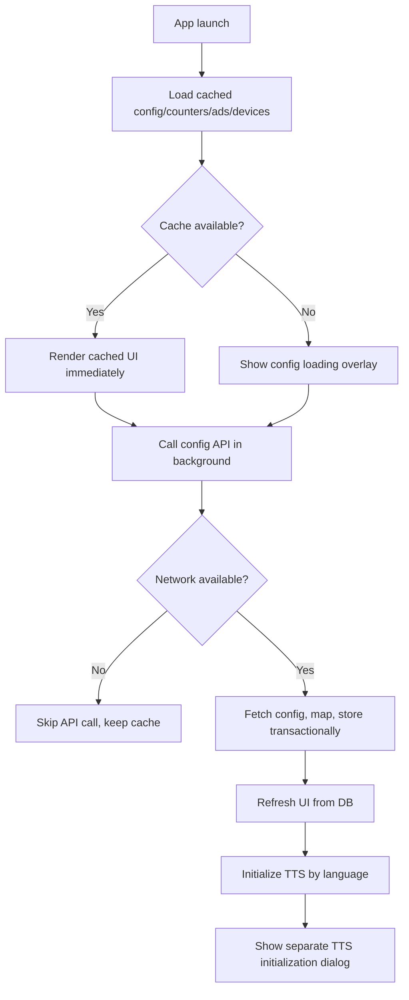
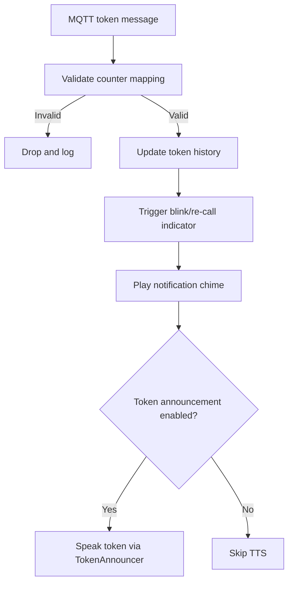
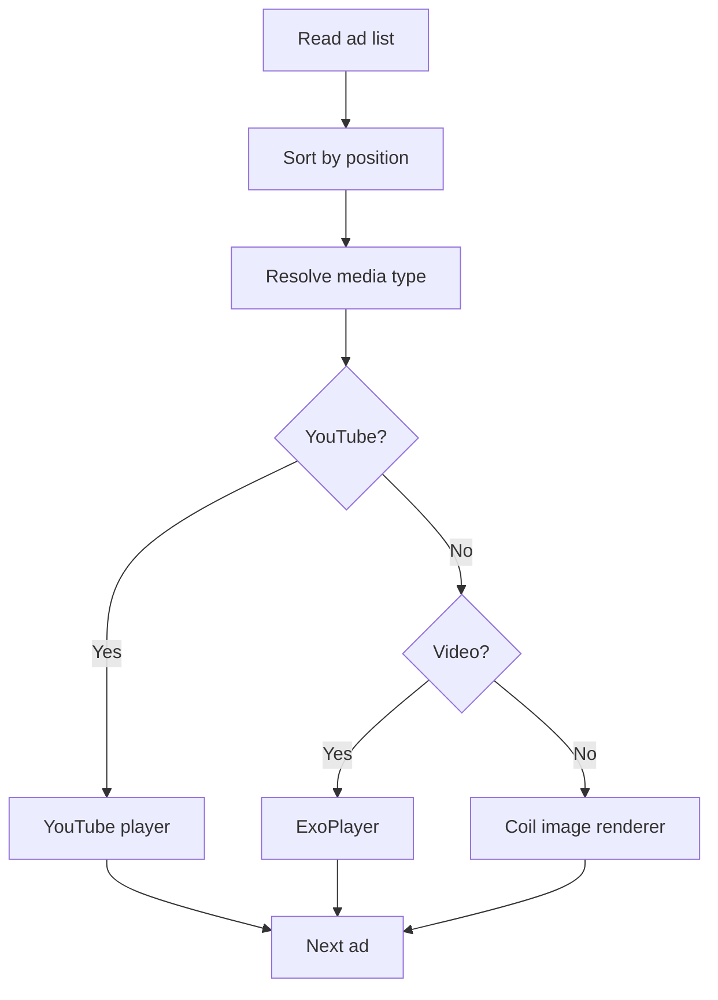

# CallQTV Master Summary - Product, UX, and Runtime Flows

This document reflects the current implementation in source code.

## 1) Product Overview
CallQTV is an Android TV queue display app with:
- Real-time token updates over MQTT
- Config-driven layout/theme/audio behavior from backend
- Token chime + optional TTS announcements
- Advertisement playback (online first, offline sync optional)
- License-based registration and validation

## 2) Current User-Facing Behavior
- Cached configuration loads first to minimize startup waiting.
- Configuration API sync runs in background and updates Room + UI.
- TTS initialization uses a separate dialog (`Preparing voice engine...`).
- Settings tabs order is: `Display`, `Audios`, `Other`, `System`.
- Offline ads default to enabled (`PreferenceHelper.isOfflineAdsEnabled` default `true`).
- Info labels in System tab are single-line and readability-tuned.

## 3) Advertisement Behavior (Current)
- Ads are sorted by configured position.
- Media type is resolved via:
  - URL extension checks
  - MIME detection fallback for extension-less/signed/local files
- Rendering path:
  - YouTube -> YouTube player
  - Video -> ExoPlayer
  - Image/GIF/WebP -> Coil image renderer
- In offline mode, ad files are synced to local storage (`Downloads/CALLQ_ADV`) and switched after sync.
- If offline/no network, downloads are skipped safely and current list is retained.

## 4) Core Runtime Flows

### 4.1 Startup + Config + TTS

### 4.2 MQTT Token Processing + Announcement

### 4.3 Ad Rotation

## 5) Acceptance Criteria
- Cached UI appears without waiting for long config API calls.
- API and ad-download calls are skipped when network is unavailable.
- TTS setup is presented separately from config loading.
- MQTT token updates continue even during background config sync.
- Ad playback supports mixed formats and degrades safely on failures.
