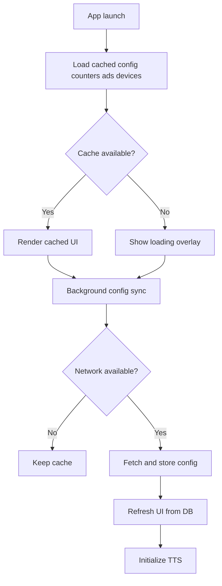
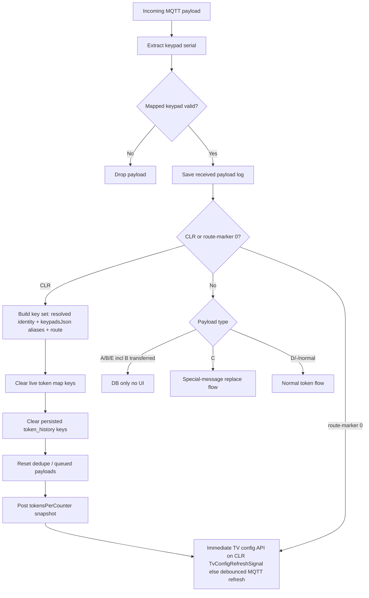
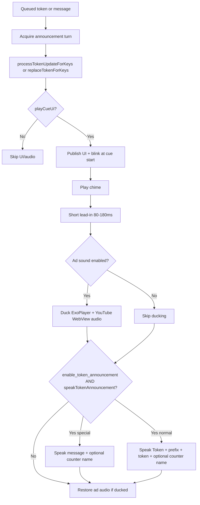
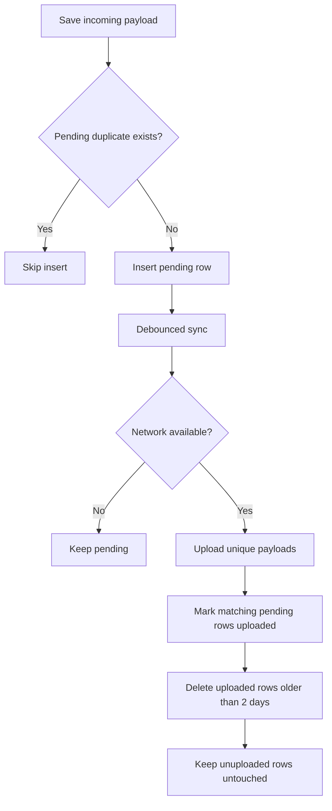
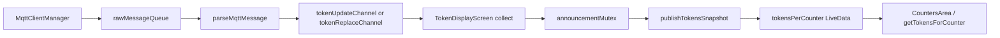
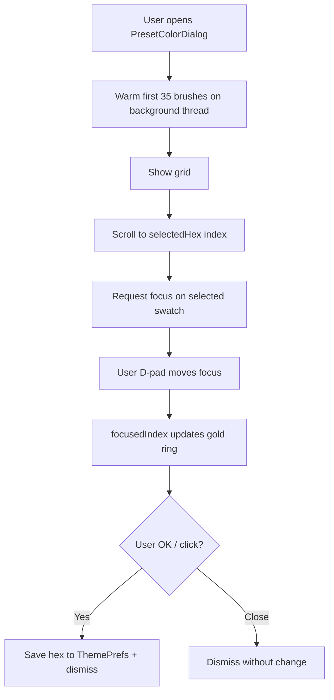
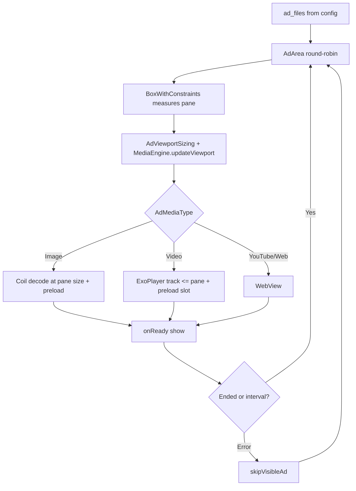

# CallQTV — Logic Flowcharts

Process flows for startup, MQTT, announcements, and payload upload. Pair with [WIREFRAMES.md](./WIREFRAMES.md) for layout.

**Canonical reference:** [MASTER_DOCUMENTATION.md](./MASTER_DOCUMENTATION.md)

---

## 1. Startup and configuration

---

## 2. MQTT token and CLR

**Normal token flow (detail):** `parseMqttMessage` → `resolveCounterIdentityFromSerial` (**keypad SN** from frame; not fixed index 18) → `tokenUpdateChannel` → `TokenDisplayScreen` → **`findCounterEntityForMqttRoute`** → `processTokenUpdateForKeys` → announcement path (§3). On-screen label: `formatTokenByPattern` + optional counter code prefix (§3 note).

---

## 3. Announcement (chime + TTS)

---

## 4. MQTT payload upload

---

## 5. MQTT → UI pipeline (reference)

---

## 6. Settings color picker open

---

## 7. Advertisement rotation

---

*Derived from CallQTV May 2026 source (app 1.0.1, Room v17, `AdViewportSizing`). See [SOURCE_CODE_DOCUMENTATION.md](./SOURCE_CODE_DOCUMENTATION.md) and [MASTER_DOCUMENTATION.md](./MASTER_DOCUMENTATION.md) §3.10.*
