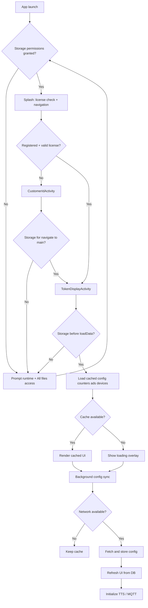
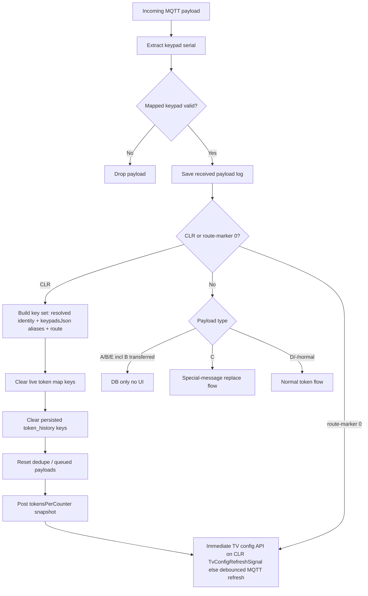
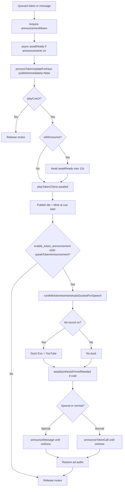
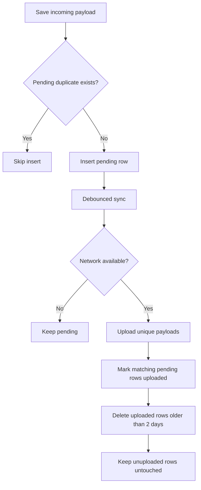
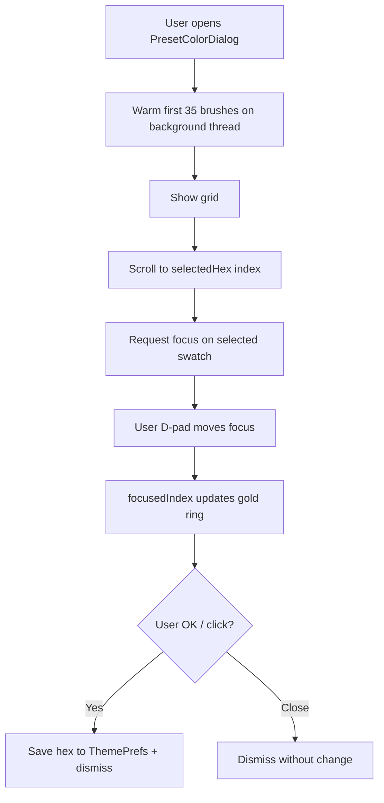
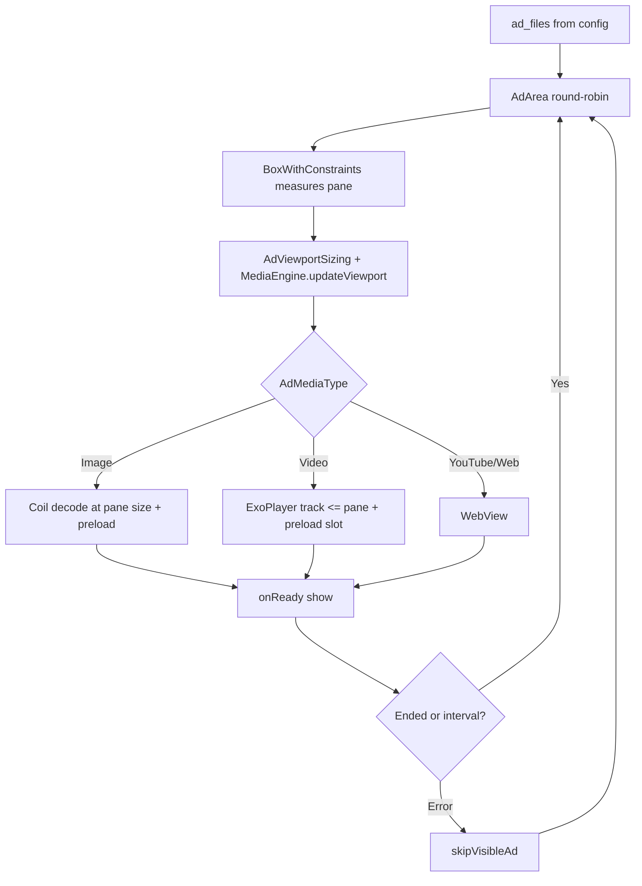

# CallQTV — Logic Flowcharts

Process flows for startup, MQTT, announcements, and payload upload. Pair with [WIREFRAMES.md](./WIREFRAMES.md) for layout.

**Canonical reference:** [MASTER_DOCUMENTATION.md](./MASTER_DOCUMENTATION.md)

---

## 1. Startup and configuration

---

## 2. MQTT token and CLR

**Normal token flow (detail):** `parseMqttMessage` → `resolveCounterIdentityFromSerial` (**CounterRouteLookupCache** or Room on IO; **keypad SN** from frame; not fixed index 18) → `tokenUpdateChannel` (cap **128**, drop-oldest) → `TokenDisplayScreen` → **`findCounterEntityForMqttRoute`** → `processTokenUpdateForKeys` → announcement path (§3). On-screen label: `formatTokenByPattern` + optional `{code}-` when `enable_counter_prefix`; index 4 **`D`** → **`ER-`** on any slot via `vipEmergencyTokensByKey` (§3.4.1 in [MASTER_DOCUMENTATION.md](./MASTER_DOCUMENTATION.md)).

---

## 3. Announcement (chime + TTS)

---

## 4. MQTT payload upload

---

## 5. MQTT → UI pipeline (reference)

```mermaid
flowchart LR
    A[MqttClientManager] --> B[rawMessageQueue]
    B --> C[parseMqttMessage]
    C --> D[tokenUpdateChannel or tokenReplaceChannel]
    D --> E[TokenDisplayScreen collect]
    E --> F[announcementMutex per token]
    F --> G[chime then publishTokensSnapshot at cue]
    G --> H[optional TTS then release mutex]
    H --> I[tokensPerCounter LiveData]
    I --> J[CountersArea / getTokensForCounter]
```

---

## 6. Settings color picker open

---

## 7. Advertisement rotation

---

## 8. Unit tests (JVM)

| Test | Covers |
|------|--------|
| `CounterRouteLookupCacheTest` | Route cache keys, TTL, scope invalidation |
| `MqttCounterRoutingTest` | Counter entity resolution |
| `VipEmergencyTokenPrefixTest` | VIP **ER-** on history slots |
| `KeypadPayloadParserTest`, `SemanticMqttParserTest`, … | MQTT parsing |

Run: `./gradlew testCallQTVDebugUnitTest` (**44** tests).

---

*Derived from CallQTV May 2026 source (app `1.0.1`, `versionCode` 2, Room v17, `minSdk` 21). Permission gate, bounded channels, route cache: [MASTER_DOCUMENTATION.md](./MASTER_DOCUMENTATION.md) §3.1. Announcement mutex + VIP ER: §3.4.1, §3.5–§3.5.2. Code index: [SOURCE_CODE_DOCUMENTATION.md](./SOURCE_CODE_DOCUMENTATION.md).*
