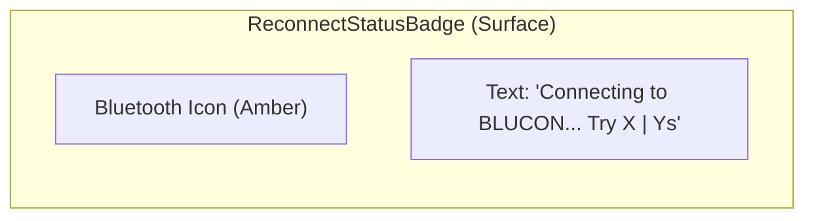
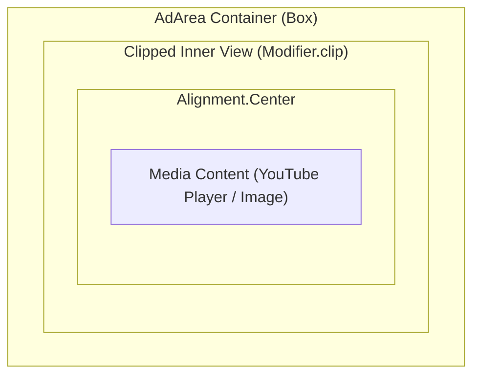

# Wireframes and Layout - CallQTV

This document provides a visualization of the principal screen layouts and key components in CallQTV.

## 1. Main Display Activity (`TokenDisplayActivity`)

```mermaid
graph TD
    subgraph Screen ["Television Viewport (1080p/4K)"]
        subgraph Header ["Header Area (Top 10-15%)"]
            A[App Logo]
            B[Company Name]
            C[Date/Time & Status Indicators]
        end
        
        subgraph MainBody ["Main Content Area"]
            direction LR
            subgraph TokenSection ["Token History"]
                D1[Token 1 (Call/Blink)]
                D2[Token 2]
                D3[Token 3]
            end
            
            subgraph AdArea ["Advertisement Container (AdArea)"]
                E[YouTube Player / Video / Image]
                E1[Strictly Centered Content]
            end
        end
        
        subgraph Overlays ["Dynamic Overlays"]
            F[Pending Calls Badge - Top Right]
            G[Reconnect Status Badge - Top Left]
            H[Settings / Theme Dialogs - Center Modal]
        end
    end
```

## 2. Reconnect Status Badge Layout

This component appears in the top-left corner when the connection is lost.



## 3. Ad Area Constraints

The `AdArea` ensures content is centered and clipped to its bounds.


