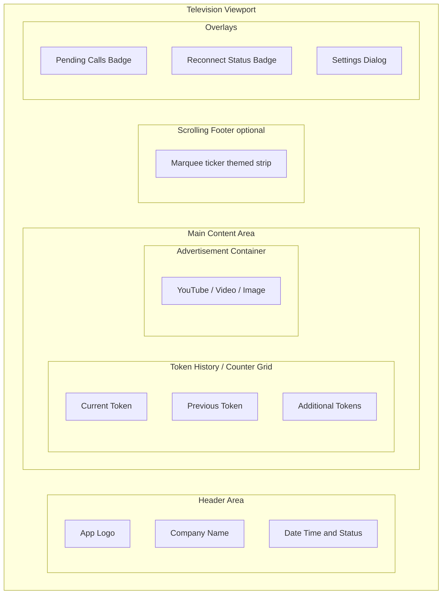
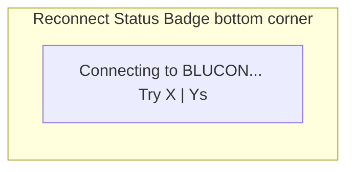
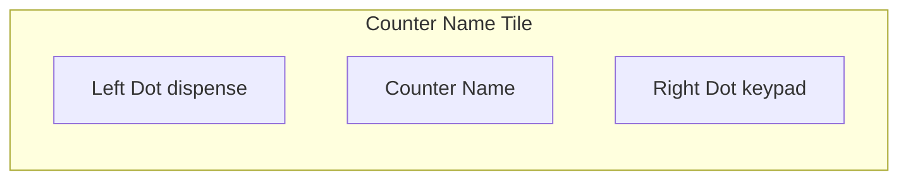
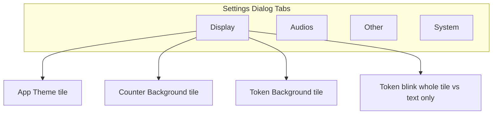
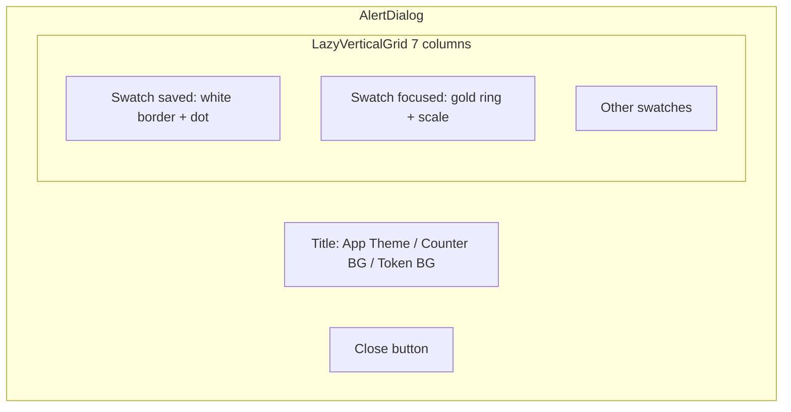
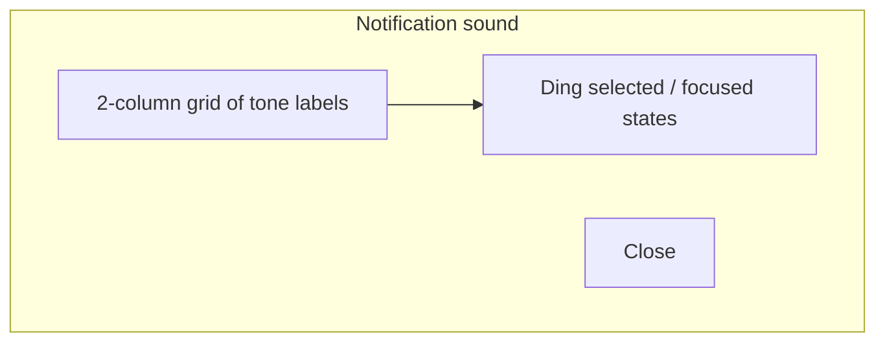

# CallQTV — UI Wireframes

Visual structure for main screens and overlays. Mermaid diagrams render in GitHub, Cursor, and many Markdown viewers.

**Canonical reference:** [MASTER_DOCUMENTATION.md](./MASTER_DOCUMENTATION.md)

---

## 1. Main display (landscape TV)

**Notes:**
- Header: MQTT/Wi‑Fi/BT icons, refresh, settings gear.
- Token grid: counter name row with dispense/keypad dots; token cells below.
- Ad placement: left/right/top/bottom per `ad_placement`; pane is **40–50%** of body (not full screen).
- Ads: image / video / YouTube / web; scaled with **fit** to pane (`AdViewportSizing`).
- Footer: `ScrollingFooter` when `scroll_enabled` and lines configured.

---

## 2. Reconnect badge

Shown when broker connectivity is lost (subject to “effective connected” rules).

---

## 3. Counter name tile (status dots)

- **Red:** idle / no recent activity (>5 min).
- **Green:** recent MQTT activity for that path.

---

## 4. Settings — Display tab (summary)

Tapping a color tile opens **PresetColorDialog** (see §5).

---

## 5. Color / theme picker dialog (`PresetColorDialog`)

**TV interaction:**
- On open: scroll to **currently selected** color; D-pad focus on that swatch (not Close).
- **Focused swatch:** gold ring (5dp), black outline, ~1.16× scale.
- **Saved selection (unfocused):** white border + corner dot.
- Loading spinner shown briefly while brushes warm (ANR prevention).

---

## 6. Notification sound picker (`NotificationSoundDialog`)

Tap a row to select and **preview** chime. Same focus highlighting pattern as color grid.

---

## 7. Special message token card (type `C`)

- Full token area replaced with centered multiline text.
- Extra padding and line height ~1.42× font size.
- Blinks per `blink_current_token` and local blink mode (whole tile vs text only).

---

## 8. Other screens (reference)

| Screen | Activity |
|--------|----------|
| Splash | `SplashScreenActivity` |
| Customer / registration | `CustomerIdActivity` |
| Main display | `TokenDisplayActivity` |

---

*Derived from CallQTV May 2026 source (app `1.0.1`, `minSdk` 21). Storage permission overlay on main when denied (`StoragePermissionHelper`). Token/VIP/announcement: [MASTER_DOCUMENTATION.md](./MASTER_DOCUMENTATION.md) §3.4.1, §3.5. Footer ticker: continuous `SeamlessTickerView` (§3.9.5). Config Retry overlay: §3.1.*
